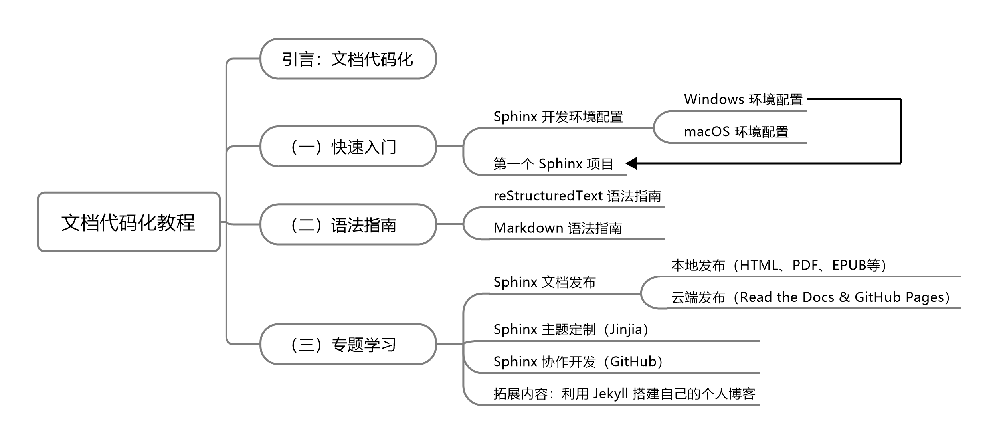

# 文本

## 语言与语法

- 简洁、精炼，避免无用赘余。
- 使用无主语格式，避免出现“我”、“你”、“您”等人称代词。
- 每个段落只能有一个主题句，后面的句子围绕主题句展开。

## 标点与格式
- 在文档中，函数名、模板名等具有一定“抽象”含义的集合使用粗斜体。
- 在文档中，单个文件或文件夹名统一使用英文，用双引号包括起来，并且与前后文字隔开一个空格。
- 出现中英文混排时，英文应与前后的中文字符（标点除外）隔开一个半角空格。
- 引用第三方内容时，应注明出处。

# 图示
- 图片统一使用全小写单词与连词符组成文件名，保证文件名的可读性。
