# 拓展内容：使用 Jekyll 搭建你的个人博客

# 1 专题介绍

欢迎同学们继续学习本教程！这是本教程的最后一个学习专题，也是整个教程的最后一章！

本专题将会向大家介绍如何使用 Jekyll 搭建免费的个人博客，经过这一段时间的学习，同学们一定有了不少学习心得与感悟，何不将他们记录下来，与大家一同分享、一同进步呢？欢迎各位同学在完成本专题的学习后将你的个人博客网址发表在教程 GitHub 的 issue 中，与世界分享你的知识与生活！

在学习此部分内容之前，希望同学们已经对 “文档代码化开发” 思想有了初步的理解，并能够使用 Sphinx 将由 reStructuredText 或 Markdown 撰写的纯文本文件转化为 HTML 网页；此外，还需要同学们掌握管理 GitHub 远程仓库和使用 GitHub Pages 发布静态网页的方法。对上述部分还不太熟悉的同学请先复习一下教程前面的各个章节，然后再着手学习此专题。

Jekyll 是一个基于简单、可扩展的静态网站生成器。Jekll 能够将由 Markdown、HTML 等标记语言书写的纯文本内容，转换生成一个完整的可发布的静态网站。在整个处理过程中，你可以调整你想要的网址样式、在模板中显示哪些数据等等。

Jekyll 可以运行在 [GitHub Page](http://pages.github.com/) 上，也就是说，你可以使用 GitHub 的服务来搭建你的项目页面、博客或者网站，而且是完全免费的。

下面我们将从 Jekll 开发环境的配置开始，一步一步完成个人博客的搭建！

> **参考资料：**
>
> + [Jekyll Docs](https://jekyllrb.com/docs/)
> + [GitHub Help | About GitHub Pages and Jekyll](https://help.github.com/en/github/working-with-github-pages/about-github-pages-and-jekyll)
> + [Microsoft Docs | Windows Subsystem for Linux (WSL)](https://docs.microsoft.com/zh-cn/windows/wsl/about)

# 2 Jekyll 环境配置

Jekyll 是一个 [Ruby Gem](https://www.jekyll.com.cn/docs/ruby-101/#gems) 组件，支持各大主流的操作系统平台，详情参阅 [Jekyll 官方文档](https://jekyllrb.com/docs/installation/)。

下面我们以 Windows (Windows Subsystem for Linux) 为平台介绍 Jekyll 环境的搭建方法，在 Linux/Unix/macOS 等操作系统下的配置 Jekll 环境的方法大致相同。

> **提示：** 使用 WSL 配置 Jekll 环境与在标准的 Linux 平台下配置 Jekll 基本相同，本节介绍的安装配置 Jekll 的方法大部分可直接应用在 Linux 平台上。

## 2.1 WSL-Ubuntu 安装与配置

Windows 并未得到 Jekyll 官方的正式支持，但是也可以通过合适的方法使 Jekll 运行在 Windows 平台上。在 Windows 10 之前，在 Windows 上搭建 Jekll 开发环境比在 Linux/Unix/macOS 上要麻烦不少，并且有时会遇到一些难以预料的错误。

新版 Windows 10 提供了一项令人惊喜的新功能——Windows Subsystem for Linux（WSL），微软公司将其译作为 “适用于 Linux 的 Windows 子系统”。WSL 可以让开发人员在 Windows 10 下原生运行 GNU/Linux 环境（包括大多数命令行工具、实用工具和应用程序），且不会产生虚拟机开销。

下面介绍如何在 Windows (Windows 10 Fall Creators Update 和更高版本) 启用 WSL 的方法：

> **注意：** WSL 不适用于运行图形用户界面，将以独占方式使用命令行。

### 启用 “适用于 Linux 的 Windows 子系统” 可选功能

1. 以管理员身份打开 PowerShell 并运行：

```powershell
Enable-WindowsOptionalFeature -Online -FeatureName Microsoft-Windows-Subsystem-Linux
```

2. 出现提示后，重启计算机即可。

### 获取 Linux 分发版 (Ubuntu)

1. 打开 Microsoft Store，搜索 "Linux” ，选择 Ubuntu


2. 在分发版的页面中，选择“获取 (Get)”，然后“安装 (Install)”


### 初始化 Linux 分发版 (Ubuntu)

安装 Linux 分发版后，必须先初始化一次后才能使用，步骤如下：

1. 启动 WSL，首次运行新安装的分发版时，会打开一个控制台窗口，其中指出需要等待一两分钟时间来完成安装。

2. 安装完成后，系统会提示创建新的用户帐户（及其密码）

> **注意：**
>
> - 此用户帐户用于启动分发版时默认登录的非管理员用户，它与 Windows 用户名无关。
> - 打开新的分发版实例时，系统不会提示你输入密码，但**如果使用 `sudo` 提升了进程的权限，则需要输入密码**
> - Linux/Unix 在输入密码的时候不会有任何提示，Unix的哲学是“没有消息就是好消息”！

### 更新和升级 Linux 分发版 (Ubuntu)

+ Windows 不会自动更新或升级 Linux 分发版，需要使用 Linux 分发版的包管理器升级已安装的包，建议定期更新。

+ 在 Debian/Ubuntu 终端中使用 `apt` 命令，并确认更新和升级分发版的包：

  ```bash
  sudo apt update && sudo apt upgrade
  ```

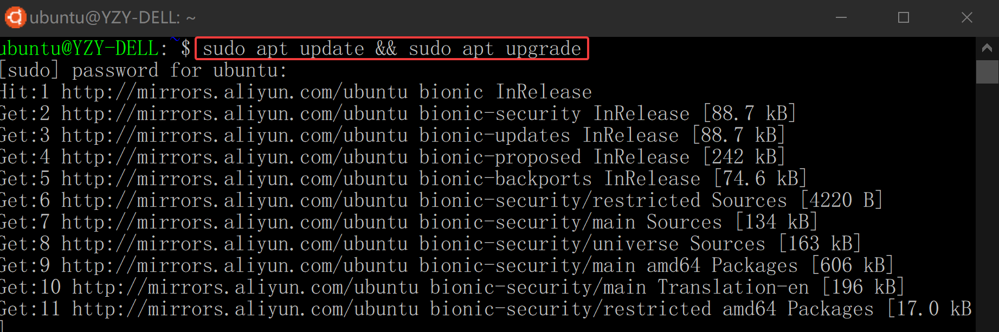

### 附录：Linux 基础命令

打开 WSL - Ubuntu 命令行窗口，试一试以下 Linux 命令：

> 命令行也被称为 Bash Shell、终端、控制台、命令行接口 (CLI)，或对于 Windows 更常见的命令提示符，这些术语常常互换使用。

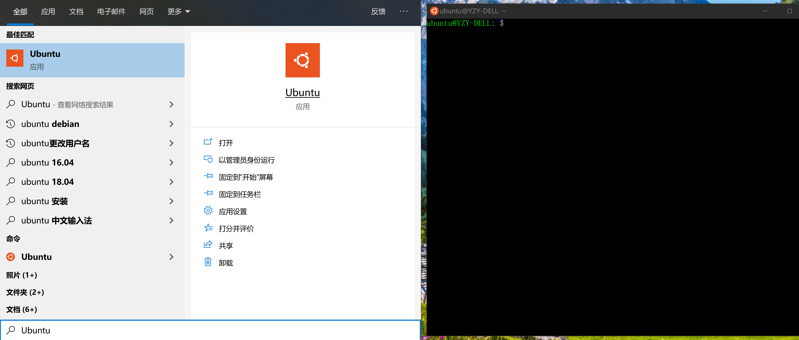

1. `pwd` 命令：当前工作目录
2. `clear` 命令：清空当前屏内容
3. `cd` 命令：切换目录（Linux 中的根目录被称为`root`目录，使用`/`表示）
4. `ls` 命令：查看当前目录下的文件（可使用`ls -l`查看文件详情）


4. `mkdir` 命令：创建文件夹
5. `rmdir` 命令：删除文件夹（需要先切换至上层目录，键入几个字符后按 Tab 键会自动完成文件名或路径。）


6. `cp` 命令：复制文件

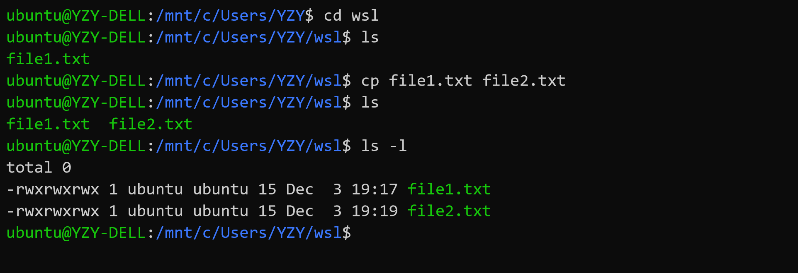

7. `cat` 命令：查看文本内容

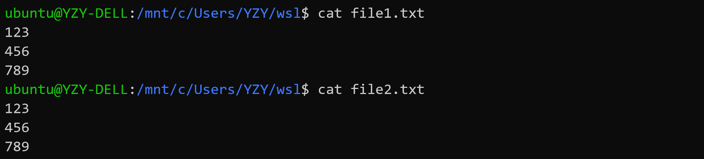

8. `diff` 命令：查看文件差异（修改`file2.txt`后比较）

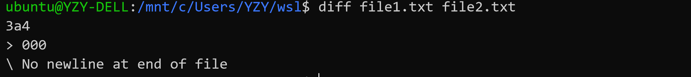

9. `head` 命令：查看文件头（可加参数`-n`）
10. `tail` 命令：查看文件尾（可加参数`-n`）


11. `wc` 命令：统计字符
+ 默认为：`<行数-l> <单词数-w> <字符数-c> <文件名>  `，可加参数进行限定）


12. `rm` 命令：删除文件（注意：Linux 没有 “回收站” 机制，直接使用`rm`要谨慎）

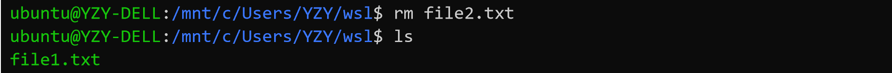

13. `mv` 命令：移动文件或重命名文件（注意：文件夹名也是大小写敏感的！）

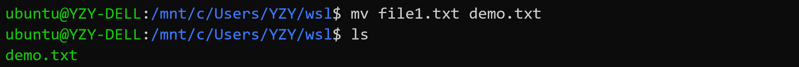


14. `less` 命令：浏览文件（可移动光标），点击字母`q`退出

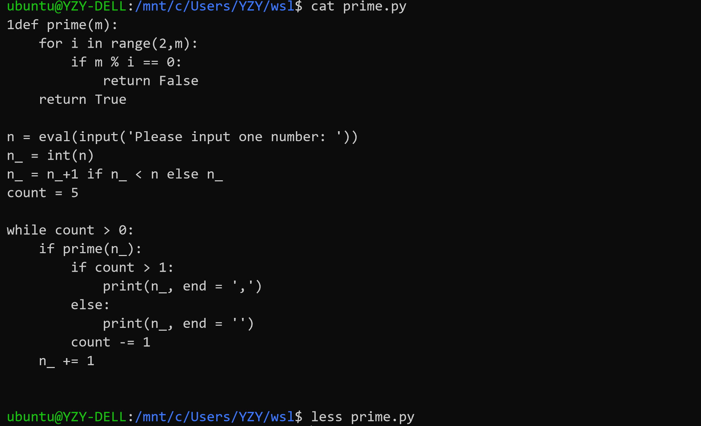

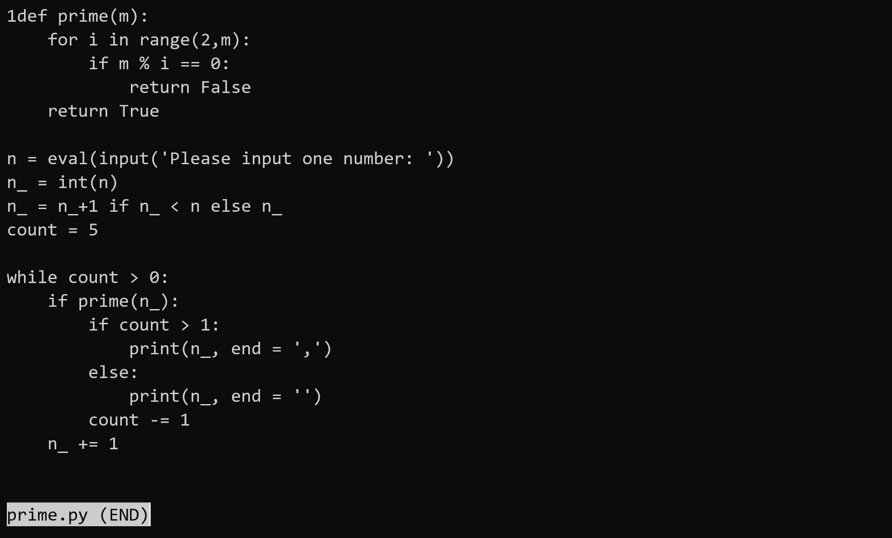

15. `chmod` 命令：修改文件读写权限

+ `chmod` 命令分为三部分：u作者，g小组成员，o其他成员；
+ 每一部分里面都有：r读，w写，x运行三个部分；
+ 如果想修改权限的话 chmod u-r 文件名称 代表修改了作者的权限，不能够读。如果想添加权限 chmod u+r 文件名称 代表允许可读权限。如果使用 chmod g-r 文件名称 代表小组成员和其他人都不能读。

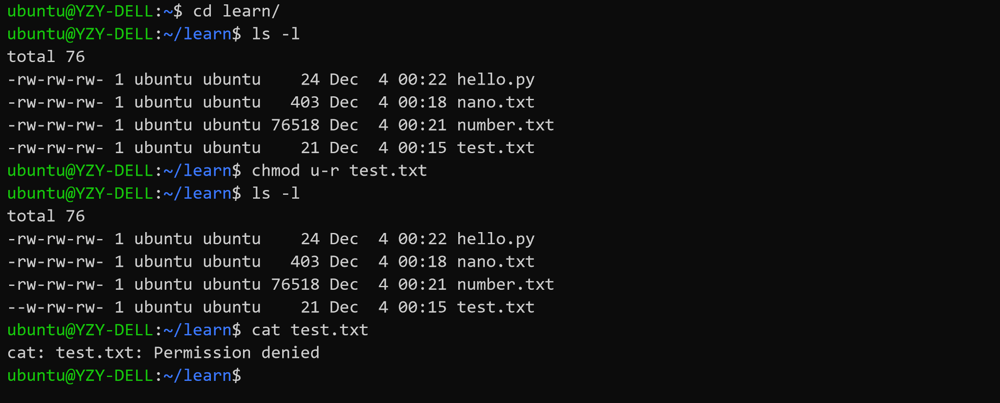

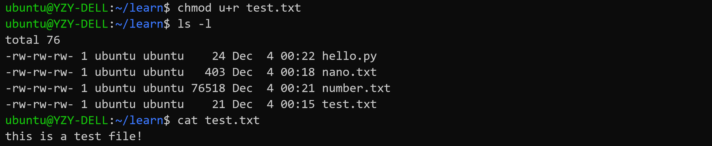

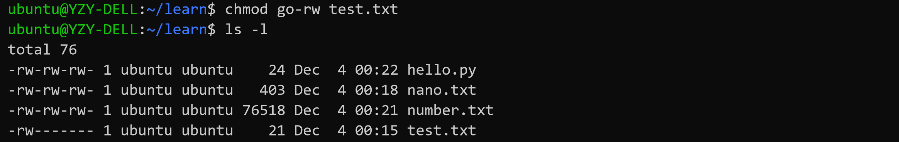

+ `chmod` 也可以通过二进制数（转十进制）进行操作

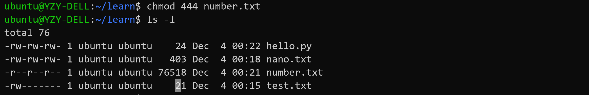

16. `grep` 命令：对文本文件进行搜索
    + `grep` 命令可以对文本文件的内容进行搜索，使用正则表达式，能够更好的查找想要的内容，还可以使用命令组合来实现更好的定位。


## 2.2 使用 VS Code 创建 WSL 集成开发环境

VS Code 内置的命令行可以将它与 WSL Linux 发行版本集成，同时在代码编辑器与 Bash 和 PowerShell 工具之间建立无缝工作流（请在安装 VS Code 时将 VS Code 添加至 path）。

### 安装适用于 Windows 的 VS Code 和 Git

1. 下载适用于 Windows 的 VS Code：[https://code.visualstudio.com](https://code.visualstudio.com/)。
2. 首次打开 VS Code 时，可能会看到以下错误消息：“找不到 Git。请使用“git.path”设置来安装或使用它。” 
   请从 git-scm 网站下载并安装适用于 Windows 的 Git：https://git-scm.com/download/win，为 VS Code 工作区中的“源代码管理”面板提供技术支持。

### 安装 Remote - WSL 扩展

在 VS Code 中，打开“扩展”视图（选择 “查看” - “扩展” 或按 `Ctrl+Shift+X` 并搜索 “wsl”。 选择如下所示的 “Remote - WSL” 扩展（应位于列表顶端）并按 “安装”。


使用 Remote - WSL 扩展，可以在 WSL 的上下文中使用 VS Code 编辑器，享受对 IntelliSense、代码导航、调试等语言功能的完整支持。 还可以选择安装[远程开发扩展包](https://marketplace.visualstudio.com/items?itemName=ms-vscode-remote.vscode-remote-extensionpack)，其中捆绑了全部三个 VS Code 远程扩展，除 WSL 外还支持在 Docker 容器内通过 SSH 工作。

### 将默认终端 Shell 更改为 WSL

在 VS Code 中，选择“视图” > “终端”（或选择使用反撇号字符的 Ctrl+`）。 将在 VS Code 窗口的底部打开命令行（或终端 shell）窗口。 通过此窗口可以运行各种命令行工具，而无需离开 VS Code。

VS Code 的默认终端是 PowerShell，若要更改默认 VS Code 终端 Shell，请打开终端下拉列表并选择“选择默认 Shell”。 将打开包含可用 Shell 列表的“设置”窗口。 选择列表中的“WSL Bash”。 （也可从命令面板打开默认终端选取器，选择 F1 键并输入“终端:***选择默认 Shell”**。）*


## 2.3 使用 WSL-Ubuntu 安装 Jekyll

安装当前最新版本的 Jekyll V4.0.0 有以下前提条件：

- [Ruby](https://www.ruby-lang.org/en/downloads/) **2.4.0** 或更高版本，包含所有用于开发的头文件（可通过执行 `ruby -v` 指令检查 ruby 版本）
- [RubyGems](https://rubygems.org/pages/download) （可通过执行 `gem -v` 指令检查版本）
- [GCC](https://gcc.gnu.org/install/) and [Make](https://www.gnu.org/software/make/) （以防你的系统中没有安装这些工具，请通过执行 `gcc -v`,`g++ -v` 和 `make -v` 指令进行检查）

### 安装 Ruby

打开 WSL-Ubuntu 命令行窗口，分别执行以下命令：

```bash
sudo apt-add-repository ppa:brightbox/ruby-ng
sudo apt-get update
sudo apt-get install ruby2.5 ruby2.5-dev build-essential dh-autoreconf
```

> **注意：** 我们将会使用到一个 [BrightBox](https://www.brightbox.com/docs/ruby/ubuntu/) 的资源库，该库包含了为 Ubuntu 的 优化的 Ruby。

### 更新 Ruby gems

在 WSL-Ubuntu 命令行窗口中执行以下命令，更新 Ruby gems：

```bash
gem update
```

### 安装 Jekyll

在 WSL-Ubuntu 命令行窗口中执行以下命令，安装 Jekyll：

```bash
gem install jekyll bundler
```

### 检查 Jekyll 安装

在 WSL-Ubuntu 命令行窗口中执行以下命令：

```bash
jekyll -v
```

如果 Jekyll 已安装在 WSL-Ubuntu 环境中，应该会显示当前安装的 Jekyll 版本：


### 附录：Jekyll 常用命令

- `jekyll new PATH` - 使用基于 gem 的默认主题在指定目录中创建一个全新的 Jekyll 站点。必要的目录也会被自动创建。
- `jekyll new PATH --blank` - 在指定的目录下创建一个全新的空的 Jekyll 站点框架。
- `jekyll build` 或 `jekyll b` - 执行一次构建，并将生成的站点输出到 `./_site` （默认） 目录
- `jekyll serve` 或 `jekyll s` - 源文件更改时构建站点并提供本地访问服务
- `jekyll doctor` - 输出任何不推荐功能或配置方面的问题
- `jekyll clean` - 删除所有生成的文件：输出目录、元数据文件、Sass 和 Jekyll 缓存。
- `jekyll help` - 显示帮助信息，也可以针对特定子命令显示帮助信息，例如 `jekyll help build`
- `jekyll new-theme` - 创建一个新的 Jekyll 主题框架

# 3  第一个 Jekyll 站点

> **注意：** 
>
> 1. Windows 和 Linux 文件存储在不同的目录中， 建议将项目文件保存到 Windows 用户主目录中。通过此设置，Windows 应用（包括 VS Code）可以访问和操作这些文件，同时你也仍能从 Linux 终端访问它们。
>
>	 + 存储在 `C:\Users\\` 中的所有文件都将映射到 WSL 发行版中的以下位置：`/mnt/c/Users/`；
>	 + 不得在 Windows 应用内编辑 WSL 根目录中的文件。
>
> 2. 在 Jekyll 中使用 UTF-8 编码时，请务必确保文件不含 `BOM` 标签！可以在 VS Code 中查看以及修改编码格式：
>
> 


## 3.1 新建 Jekyll 项目

在 Windows 合适的位置新建一个 `myblog` 文件夹，按住 <kbd>shift</kbd> 对此文件夹单击鼠标右键，选择 “在此打开 Linux Shell”

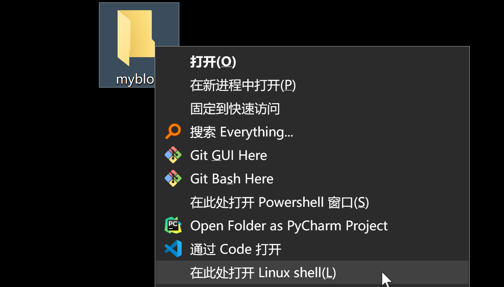

在打开的 WSL-Ubuntu 命令行窗口中，使用 `code .` 命令在 VS Code 中打开此目录，并激活 VS Code 的 WSL 终端：

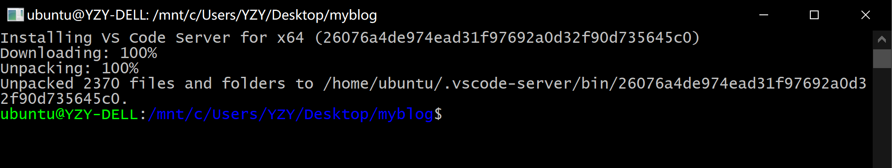


## 3.2 添加 index.html 文件

使用 VS Code 在 ***myblog*** 目录下新建一个 ***index.html*** 文件，填写以下内容，并保存：

```html
<!doctype html>
<html>
  <head>
    <meta charset="utf-8">
    <title>Home</title>
  </head>
  <body>
    <h1>Hello World!</h1>
  </body>
</html>
```

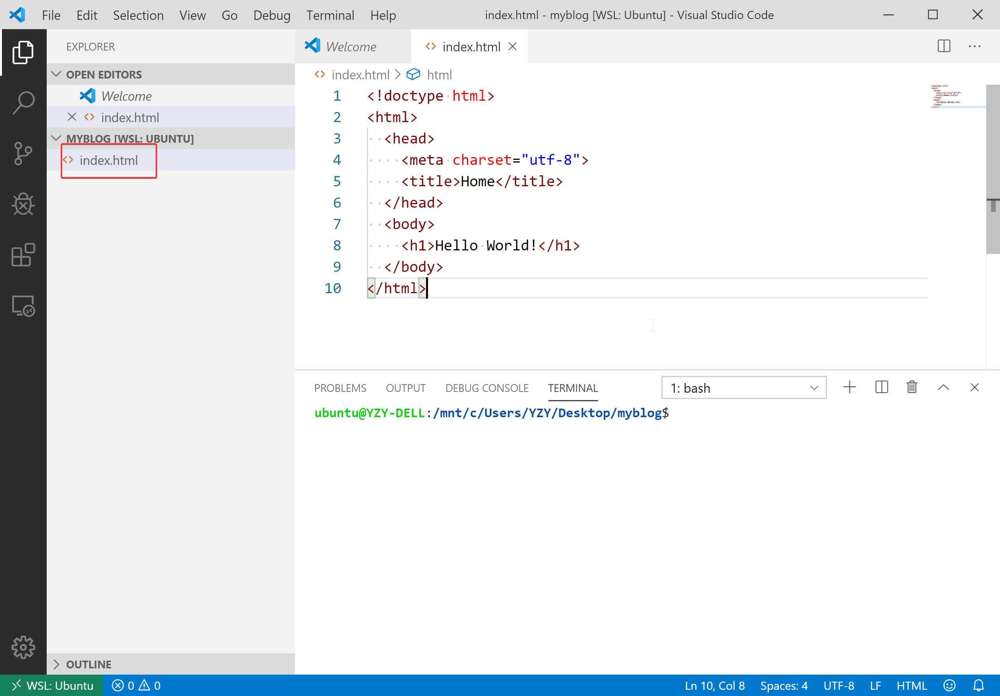

## 3.3 发布 Jekyll 测试站点

现在可以使用 Jekyll 发布我们的测试站点了，我们有两种命令来发布站点：

- `jekyll build` -  生成站点，并将静态站点输出到名为`_site`的目录.
- `jekyll serve` - 生成站点，并运行一个本地 Web 服务器，可在浏览器中通过`http://localhost:4000`访问改站点，你对文本的修改都将会重构站点的内容。

通常在本地开发时使用`jekyll serve` 命令，而`jekyll build` 命令用来为生产环境构建站点。

1. 在 VS Code 的 WSL 终端中执行 `jekyll serve` 命令：

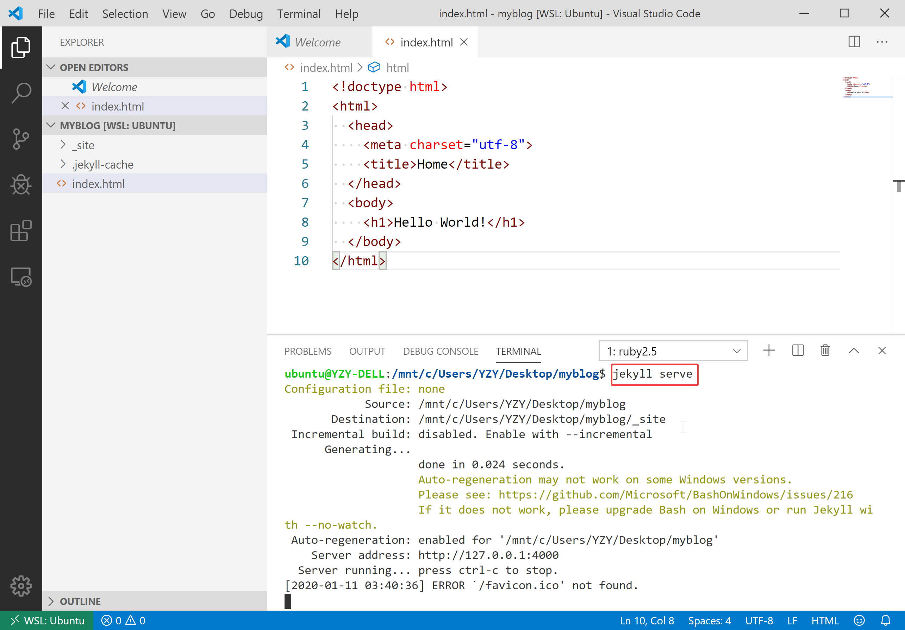

2. 在浏览器中转到 `http://localhost:4000`——Hello World!

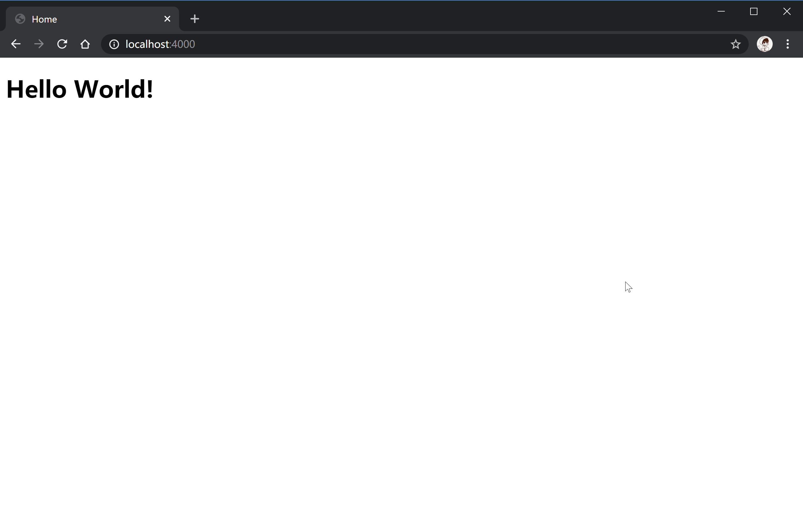

3. 在 VS Code 中的 ` <h1>Hello World!</h1>` 下添加一行：

```html
<h2>Hello Jekyll!</h2>
```

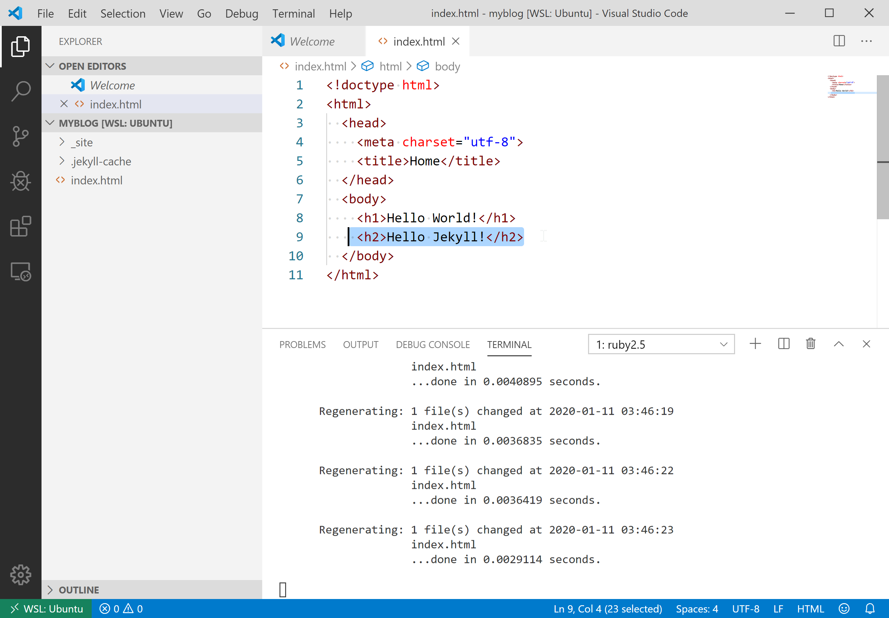

4. 在浏览器中刷新一下当前页面，看看发生了什么：


# 4 使用 Jekyll 与 GitHub Pages 搭建个人博客