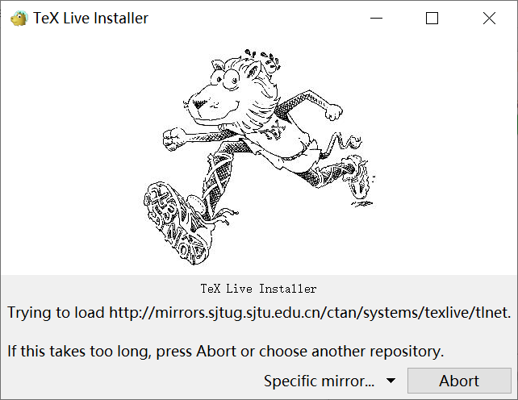
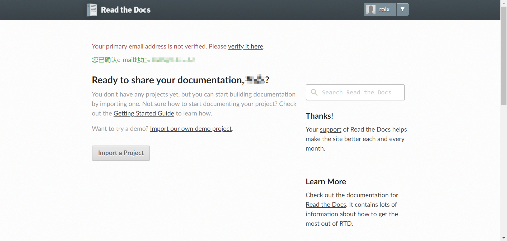
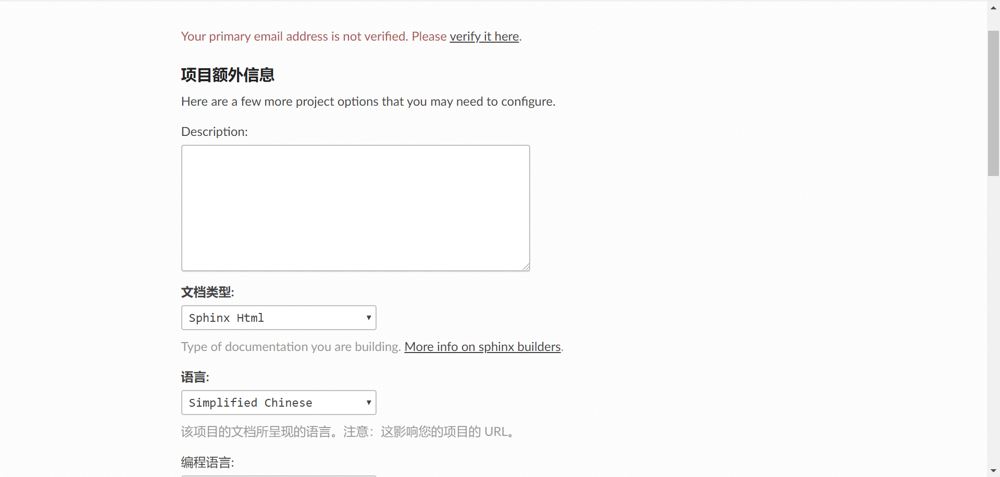

Sphinx 可以为我们提供多种发布的格式，如 HTML、LaTeX、ePub、Texinfo、纯文本等。在这里我们主要为同学们介绍几种常见的发布格式。

本地发布
========

发布 HTML
------------
发布 HTML 格式是 Sphinx 发布最基础的操作，如我们在学习生成第一个 Sphinx 项目时所看到的，只需在发布时使用 make html 或 sphinx-build -b html <sourcedir> <builddir> 命令即可。更多有关 HTML 主题定制的内容，请参阅后文 HTML 主题定制章节。

.. image:: images/make-html.png

发布 PDF
------------
发布 PDF 格式的过程较为复杂，也有几种不同的途径，例如可以使用 rst2pdf 这个工具，但它只能处理较为基本的格式。当我们需要解决分页、目录、排版、换行、脚注、表格、交叉参考、插图等问题时，就可以选用 LaTeX 作为中间格式来转换 PDF。LaTeX 中的文档结构可以单独设置样式，相同的数据结构可以用不同的格式显示，并具有不同的设计。下面就为同学们介绍如何使用 rst2pdf 输出简单 PDF，以及使用 Sphinx 输出 LaTeX 格式文件，再使用 Pandoc 转换为 PDF 格式文件的方法。

1. 使用 rst2pdf 输出简易 PDF
* 通过 pip install --user rst2pdf 下载 rst2pdf 工具。
* 

* 使用 Sphinx 输出 LaTeX 格式文件

首先，我们需要在官网http://tug.org/texlive/acquire-netinstall.html或清华大学的镜像站下载并安装 TeX Live，这是一款……的工具，目前于2019年4月发布了19版本。安装过程可能会花费比较长的时间，可以通过安装过程对话框查看安装进度。

.. image:: images/texlive2.png

安装完成后，我们可以在命令行中输入 lex -version 来检验是否安装成功。

.. image:: images/texlive-version.png

* 使用 Pandoc 将 LaTeX 格式文件转换为 PDF 格式文件

Pandoc 是一款标记语言转换工具，可实现不同标记语言间的格式转换。https://www.pandoc.org/installing.html

我们要去修改 conf.py 中 Options for LaTeX output 的 latex_elements 变量。

如果要生成中文PDF，还需要确认安装了东亚语言包和字体包(texlive-lang-cjk, texlive-fonts-recommands之类）。
然后配置conf.py，在latex_elements中加入:
latex_elements = {
# The paper size ('letterpaper' or 'a4paper').
#'papersize': 'letterpaper',

# The font size ('10pt', '11pt' or '12pt').
#'pointsize': '10pt',

# Additional stuff for the LaTeX preamble.
'preamble': '''
\\hypersetup{unicode=true}
\\usepackage{CJKutf8}
\\AtBeginDocument{\\begin{CJK}{UTF8}{gbsn}}
\\AtEndDocument{\\end{CJK}}
''',
最后运行 make latexpdf 即可。

云端发布
========
使用 Read the Docs 进行发布
-----------------------------
Read the Docs 是一个提供了托管服务的平台。我们可以把生成的 Sphinx 网页托管到这个平台上进行在线发布。首先我们需要在这个平台注册账号，不过也可以选择关联我们的 Github 账号。

之后我们选择 Import a Project 来导入项目，如果没有自动识别，则可以点击手动导入。

.. image:: images/rtd-set-project.png

在添加项目页面，我们需要填写好项目的名称、地址等信息。

在额外信息界面，我们可以补充诸如所使用的编程语言等信息。最后点击完成，即可完成导入项目过程。
接下来，回到 Github，在项目仓库的首页右边寻找 Settings，点击进入，

此外，我们还可以自定义域名：

1. 在域名管理中添加 DNS 的 CNAME 记录到 readthedocs.io。
2. 在项目的 Admin -> Domains 中设置上一步添加的域名，开启 HTTPS，保存。

使用 Github Pages 进行发布
-----------------------------
