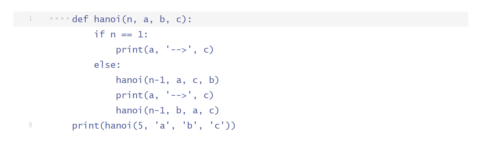
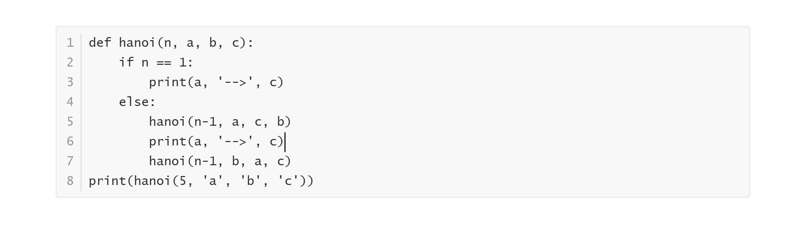

# Markdown 语法指南


---

# 1 简介


- Markdown 是一种轻量级标记语言，它允许人们使用易读易写的纯文本格式编写文档。
- Markdown 语言在 2004 由约翰·格鲁伯（英语：John Gruber）创建。
- Markdown 编写的文档可以导出 HTML 、Word、图像、PDF、Epub 等多种格式的文档。
- Markdown 编写的文档后缀为 **.md** 或 **.markdown**。
- Markdown 能被使用来撰写电子书，如：Gitbook。
- 当前许多网站都广泛使用 Markdown 来撰写帮助文档或是用于论坛上发表消息，如GitHub。


## 编辑器

本教程使用 Typora 编辑器来讲解 Markdown 的语法，Typora 支持 MacOS 、Windows、Linux 平台，且包含多种主题，编辑后直接渲染出效果。Typora 支持导出HTML、PDF、Word、图片等多种类型文件。
> Typora 官网：https://typora.io/


## 测试实例

使用 Typora 编写 Hello World! ：

```markdown
# Hello World! 
```

显示效果如下：

> # Hello World!

---

# 2 标题

Markdown 标题有两种表示方法。


## 使用 = 和 - 标记一级和二级标题

= 和 - 标记语法格式如下：

```markdown
我展示的是一级标题
=================

我展示的是二级标题
-----------------
```

显示效果如下：

> 我展示的是一级标题
> =================
>
> 我展示的是二级标题
> -----------------


## 使用 # 号标记多级标题

使用 **#** 号可表示 1-6 级标题，一级标题对应一个 **#** 号，二级标题对应两个 **#** 号，以此类推。

```markdown
# 一级标题
## 二级标题
### 三级标题
#### 四级标题
##### 五级标题
###### 六级标题
```

显示效果如下所示：

> # 一级标题
> ## 二级标题
> ### 三级标题
> #### 四级标题
> ##### 五级标题
>
> ###### 六级标题

---

# 3 格式

本节介绍Markdown中的段落和字体格式。


## 段落

Markdown 对于段落没有特殊的格式语法，段落换行可在使用两个以上空格加回车，或在段落后面使用一个空行来表示重新开始一个段落——更加推荐后一种换行的方法!


## 字体

Markdown 可以使用以下几种字体：

```markdown
*斜体文本*
_斜体文本_
**粗体文本**
__粗体文本__
***粗斜体文本***
___粗斜体文本___
```

显示效果如下所示：

> *斜体文本*
> _斜体文本_
> **粗体文本**
> __粗体文本__
> ***粗斜体文本***
> ___粗斜体文本___


## 分隔线

你可以在一行中用三个以上的星号、减号、底线来建立一个分隔线，行内不能有其他东西。你也可以在星号或是减号中间插入空格。下面每种写法都可以建立分隔线：

```markdown
***

* * *

*****

- - -

----------
```

显示效果如下所示：

> ***
>
> * * *
>
> *****
>
> - - -
>
> ----------


## 删除线

如果段落上的文字要添加删除线，只需要在文字的两端加上两个波浪线 **~~** 即可，实例如下：

```markdown
Markdown
~~Markdown~~
```

显示效果如下所示：

> Markdown
> ~~Markdown~~


## 下划线

下划线可以通过 HTML 的 **<u>** 标签来实现：

```markdown
<u>带下划线文本</u>
```

显示效果如下所示：

> <u>带下划线文本</u>


## 脚注

脚注是对文本的补充说明。

Markdown 脚注的格式如下:

```markdown
这是一条脚注[^FOOTNOTE]

[^FOOTNOTE]: Let's try markdown!
```

以下实例演示了脚注的用法：

这是一条脚注[^FOOTNOTE]

[^FOOTNOTE]: Let's try markdown!

---

# 4 列表

Markdown 支持有序列表和无序列表。


## 无序列表

无序列表使用星号(*****)、加号(**+**)或是减号(**-**)作为列表标记：

```markdown
* 第一项
* 第二项
* 第三项

+ 第一项
+ 第二项
+ 第三项


- 第一项
- 第二项
- 第三项
```

显示结果如下：

> * 第一项
> * 第二项
> * 第三项
>
> + 第一项
> + 第二项
> + 第三项
>
>
> - 第一项
> - 第二项
> - 第三项


## 有序列表

有序列表使用数字并加上 **.** 号来表示，如：

```markdown
1. 第一项
2. 第二项
3. 第三项
```

显示结果如下：

> 1. 第一项
> 2. 第二项
> 3. 第三项


## 列表嵌套

列表嵌套只需在子列表中的选项添加四个空格（一个Tab）即可：

```markdown
1. 第一项：
    - 第一项嵌套的第一个元素
    - 第一项嵌套的第二个元素
2. 第二项：
    - 第二项嵌套的第一个元素
    - 第二项嵌套的第一个元素
```

显示结果如下：

> 1. 第一项：
>     - 第一项嵌套的第一个元素
>     - 第一项嵌套的第二个元素
> 2. 第二项：
>     - 第二项嵌套的第一个元素
>     - 第二项嵌套的第一个元素

---

# 5 区块

Markdown 区块引用是在段落开头使用 **>** 符号 ，然后后面紧跟一个**空格**符号：

```markdown
> 区块引用
```

显示结果如下：

> 区块引用


另外区块是可以嵌套的，一个 **>** 符号是最外层，两个 **>** 符号是第一层嵌套，以此类推退：

```markdown
> 最外层
> > 第一层嵌套
> > > 第二层嵌套
```

显示结果如下：

> 最外层
> > 第一层嵌套
> >
> > > 第二层嵌套


## 区块中使用列表

区块中使用列表实例如下：

```markdown
> 区块中使用列表
> 1. 第一项
> 2. 第二项
> + 第一项
> + 第二项
> + 第三项
```

显示结果如下：

> 区块中使用列表
> 1. 第一项
> 2. 第二项
> + 第一项
> + 第二项
> + 第三项


## 列表中使用区块

如果要在列表项目内放进区块，那么就需要在 **>** 前添加四个空格的缩进。

区块中使用列表实例如下：

```markdown
* 第一项
    > GitHub
    > Markdown
* 第二项
```

显示结果如下：

> * 第一项
>     > GitHub
>     > Markdown
> * 第二项

---

# 6 代码

本节介绍Markdown中插入代码块的方法。


## 单行代码

如果是段落上的一个函数或片段的代码可以用反引号把它包起来（**`**），例如：

```markdown
`printf()`  //函数
```

显示结果如下：

> `printf()`  //函数


## 代码区块

代码区块使用 **4 个空格**或者一个**制表符（Tab 键）**。

例如：



渲染后结果如下：



（**推荐**）或使用一对 **```** 包裹一段代码，还可同时指定相应的编程语言（Markdown 会根据指定的代码语言对该段代码进行语法高亮）。

 ```markdown
 ```javascript
 $(document).ready(function () {
  alert('Bingo！');
 });
 ```
 ```

效果如下所示：

```javascript
$(document).ready(function () {
    alert('Bingo！');
});
```

---

# 7 链接

本节介绍Markdown中的普通链接和高级链接。


## 普通链接

链接使用方法如下：

```markdown
[链接名称](链接地址)

或者

<链接地址>
```

例如：

```
这是一个链接 [百度](https://www.baidu.com/)
```

显示结果如下：

> 这是一个链接 [百度](https://www.baidu.com/)


直接使用链接地址：

```markdown
<https://www.baidu.com/>
```

显示结果如下：

> <https://www.baidu.com/>


## 高级链接

```
链接也可以用变量来代替，文档末尾附带变量地址：
这个链接用 1 作为网址变量 [Google][1]
然后在文档的结尾为变量赋值（网址）

[1]: http://www.google.com/
```

显示结果如下：

> 链接也可以用变量来代替，文档末尾附带变量地址：
> 这个链接用 1 作为网址变量 [Google][1]
> 然后在文档的结尾为变量赋值（网址）
>
> [1]: http://www.google.com/

---

# 8 图片

Markdown 中插入图片的方法和插入链接的方法类似。


##  插入图片

Markdown 中插入图片的语法如下：

```markdown


```

- 开头一个感叹号 !
- 接着一个方括号，里面放上图片的替代文字
- 接着一个普通括号，里面放上图片的网址，最后还可以用引号包住并加上选择性的 'title' 属性的文字。

使用实例：

```markdown


```

显示结果如下：


(将鼠标移至下面的图片时会显示 "GitHub Desktop Icon")


你还可以像网址那样对图片网址使用变量:

```markdown
这个链接用 1 作为网址变量 [GitHub Desktop][1].
然后在文档的结尾位变量赋值（网址）

[1]: https://desktop.github.com/images/desktop-icon.svg
```

显示结果如下：

> 这个链接用 1 作为网址变量 [GitHub Desktop][1].
> 然后在文档的结尾位变量赋值（网址）
>
> [1]: https://desktop.github.com/images/desktop-icon.svg


## 设定图片的高度与宽度

目前 Markdown 还没有办法指定图片的高度与宽度，如果你需要的话，你可以使用 html 中的  标签。

```

```

显示结果如下：


---

# 9 表格

本节介绍Markdown的表格制作方法。


## 插入表格

Markdown 制作表格使用 **|** 来分隔不同的单元格，使用 **-** 来分隔表头和其他行。

语法格式如下：

```
|  表头   | 表头  |
|  ----  | ----  |
| 单元格  | 单元格 |
| 单元格  | 单元格 |
```

以上代码显示结果如下：
> | 表头   | 表头   |
> | ------ | ------ |
> | 单元格 | 单元格 |
> | 单元格 | 单元格 |


## 对齐方式

**我们可以设置表格的对齐方式：** （单元格中的内容默认左对齐）

- **-:** 设置内容和标题栏居右对齐。
- **:-** 设置内容和标题栏居左对齐。
- **:-:** 设置内容和标题栏居中对齐。
- 注意 **:** 和 **-** 之间不能有空格，**-** 的数量无限制。

实例如下：

```
| 左对齐 | 右对齐 | 居中对齐 |
| :-----| ----: | :----: |
| 单元格 | 单元格 | 单元格 |
| 单元格 | 单元格 | 单元格 |
```

以上代码显示结果如下：

> | 左对齐 | 右对齐 | 居中对齐 |
> | :----- | -----: | :------: |
> | 单元格 | 单元格 |  单元格  |
> | 单元格 | 单元格 |  单元格  |

---

# 10 高级技巧

本节介绍一些常用的 Mardown 高级技巧，更多内容请参考 < https://spec.commonmark.org/ >


##  HTML 支持

不在 Markdown 涵盖范围之内的标签，都可以直接在文档里面用 HTML 撰写。

目前支持的 HTML 元素有：`<kbd> <b> <i> <em> <sup> <sub> <br>`等 ，如：

```
使用 <kbd>Ctrl</kbd>+<kbd>Alt</kbd>+<kbd>Del</kbd> 重启电脑
```

输出结果为：
> 使用 <kbd>Ctrl</kbd>+<kbd>Alt</kbd>+<kbd>Del</kbd> 重启电脑


## 转义

Markdown 使用了很多特殊符号来表示特定的意义，如果需要显示特定的符号则需要使用转义字符，Markdown 使用反斜杠转义特殊字符：

```
**文本加粗** 
\*\* 正常显示星号 \*\*
```

输出结果为：

> **文本加粗** 
> \*\* 正常显示星号 \*\*

Markdown 支持以下这些符号前面加上反斜杠来帮助插入普通的符号：

```
\   反斜线
`   反引号
*   星号
_   下划线
{}  花括号
[]  方括号
()  小括号
5#   井字号
+   加号
-   减号
.   英文句点
!   感叹号
```


## 公式

当你需要在编辑器中插入数学公式时，可以使用两个美元符 $$ 包裹 TeX 或 LaTeX 格式的数学公式来实现。提交后，会根据需要加载 Mathjax 对数学公式进行渲染。如：

```
$$
\mathbf{V}_1 \times \mathbf{V}_2 =  \begin{vmatrix} 
\mathbf{i} & \mathbf{j} & \mathbf{k} \\
\frac{\partial X}{\partial u} &  \frac{\partial Y}{\partial u} & 0 \\
\frac{\partial X}{\partial v} &  \frac{\partial Y}{\partial v} & 0 \\
\end{vmatrix}
$$ 
```

输出结果为：

> $$
> \mathbf{V}_1 \times \mathbf{V}_2 =  \begin{vmatrix} 
> \mathbf{i} & \mathbf{j} & \mathbf{k} \\
> \frac{\partial X}{\partial u} &  \frac{\partial Y}{\partial u} & 0 \\
> \frac{\partial X}{\partial v} &  \frac{\partial Y}{\partial v} & 0 \\
> \end{vmatrix}
> $$

---

# 参考资料

+ [Markdown Reference](https://commonmark.org/help/) 
+ [Markdown 教程 | 菜鸟教程](https://www.runoob.com/markdown/md-tutorial.html)
