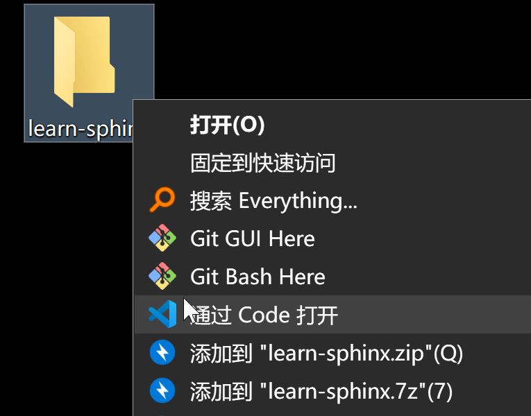
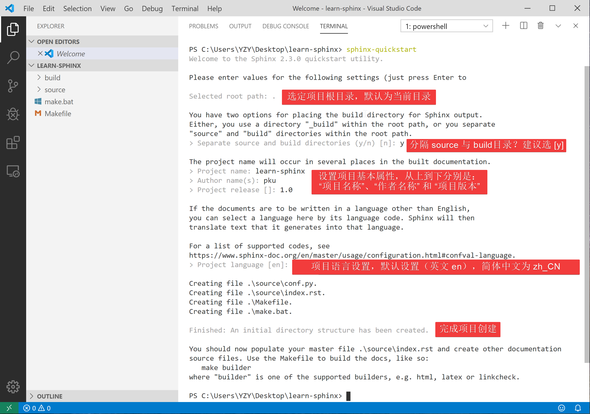
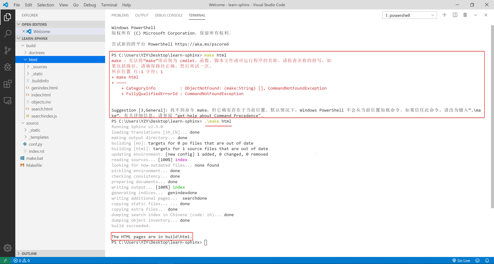
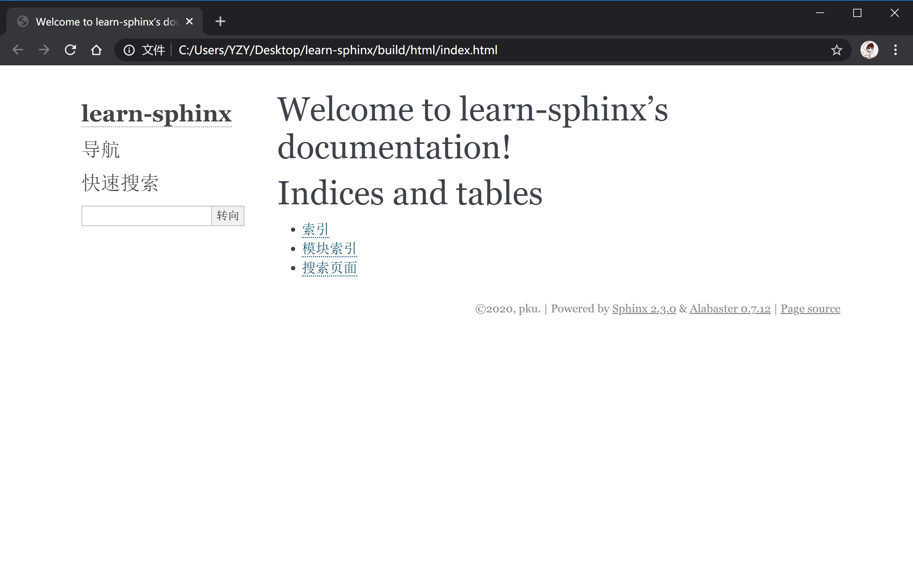

# Sphinx 快速入门

- [Sphinx](http://www.sphinx-doc.org/) 是一种基于 Python 的文档工具，它可以令人轻松的撰写出清晰且优美的文档，由 Georg Brandl 在 BSD 许可证下开发。
- Sphinx 最初是为创作[新版 Python 文档](http://docs.python.org/)而开发的，如今它已成为 Python 项目首选的文档工具，并对其它开发语言也有很好的支持。

- Sphinx 采用 [reStructuredText](https://docutils.sourceforge.io/rst.html) 作为默认标记语言，并使用 [Docutils](http://docutils.sf.net/) 对标记文本进行解析和转换。


## 1 Sphinx 开发环境配置

参考 Sphinx 的官方文档，[配置 Sphinx 开发环境](http://www.sphinx-doc.org/en/master/usage/installation.html)主要包括安装 Python 开发环境、使用 pip 工具安装 sphinx 、安装配置文本、代码编辑器等步骤，同时还涉及到使用命令行和修改系统环境变量等操作。这些步骤对于初学者来说略有些复杂繁琐，很容易就迷失在各种琐碎的配置细节中，打击同学们的学习热情。

不过 Python 社区始终有一批能人志士在为简化和优化开发环境配置而作各种努力，Anaconda 就是其中相当出色一个，下面将会介绍如何通过 Anaconda 和 VS Code 在 Windows 和 macOS 两大操作系统上配置 Sphinx 开发环境，同学们可以根据自己使用的操作系统查看相应的部分。

> + **Anaconda** 是一个开源的 Python 发行版，支持 Windows、macOS、Linux，Anaconda 是一个打包的集合，里面预装好了conda、Python 解释器、众多第三方库（比如 Sphinx）、科学计算工具等等，其核心功能是由 conda 提供的包管理与环境管理功能。
>
> + **Visual Studio Code (VS Code)** 是由 Microsoft 公司开发的新一代代码编辑器，支持 Windows、macOS、Linux，将代码编辑器、调试器、终端等工具整合于一体，具有语法高亮、代码补全、括号匹配等功能，支持版本管理和远程开发，并拥有丰富的拓展生态。

---

### 1.1 Windows 环境配置

> **注意：**以下步骤不需要同学们预先安装 Python 解释器（如果之前有安装也可以考虑将其卸载），而是直接使用 Anaconda 内集成的 Python 解释器，如果同学们先前已经安装过单独的 Python 解释器（运行 Sphinx 必须预先安装 Python 3.5 及以上版本），可直接在命令行中使用命令 `pip install sphinx` 安装 Sphinx 及运行 Sphinx 所需要的 [docutils](http://docutils.sourceforge.net/)、[jinja2](http://jinja.pocoo.org/) 等第三方库（前提是 Python 和 Pip 已添加在系统变量的 path 中）。
>
> 更加推荐同学们使用 Anaconda 来完成 Sphinx 开发环境配置，因为 conda 将几乎所有的工具、第三方库都当做 package 对待，甚至包括 python 和 conda 自身，它可以帮助我们方便地管理自己的 Python 开发环境，不仅能够将不同开发项目所依赖的开发环境完全独立开来，还可轻易地复制整个 Python 环境到其他机器上。

#### Anaconda 安装与配置

1. 打开 [Anaconda 官方下载页](https://www.anaconda.com/distribution/)，下载适合的安装包：


> **提示：** 如果官网下载速度较慢，可到清华大学开源软件镜像站下载 [Anaconda 安装包](https://mirrors.tuna.tsinghua.edu.cn/anaconda/archive/)。

2. 下载完成后，运行可执行文件进行安装：


> **注意：**
>
> 1. Anaconda 需要占用较大的存储空间，可考虑安装在非系统盘。
>
> 2. 请在 “Advanced Options” 中将勾选两个可选选项：
>
> 
>
> - **第一个选项** 会将 Anaconda 的安装目录添加至系统环境变量的 path 中，有利于我们之后在 VS Code 中快速激活 conda 环境，以及直接使用 base 环境中已安装的库和脚本，简化操作流程，若是在安装过程中没有勾选此选项，需要自行添加系统环境变量，即添加Anaconda的安装路径以及到path。
>
>   - 如上图红字所示，Anaconda 官方不建议勾选此选项，而建议使用 Anaconda Prompt (或 Anaconda Powershell Prompt，以下将两者统称为 Anaconda Prompt) 。这是因为勾选此选项会将 Anaconda 的若干目录添加至 path 目录中的最前面；如果用户之前已经安装了其他 Python 解释器，勾选此选项会导致用户直接调用 Python 时优先调用 Anaconda 内置的 Python 解释器，而不是用户单独安装的 Python 解释器，如下图所示：
>
>     
>
>   - 假如同学们依然希望系统默认调用先前单独安装的 Python 解释器，解决方法是在完成安装 Anaconda 后，手动将原 path 中 Python 路径移动到 Anaconda 系列目录的前面，操作方法如下：
>
>     
>
>   - 此时，在命令行调用 Python 时会优先调用单独安装的 Python 解释器，只有在激活 conda 环境后才会调用 conda 里的 Python 解释器。（可以看到两个 Python 解释器的版本和版权说明有所区别）
>
>     
>
> - **第二个选项** 可使其他 Python 开发工具（如 VS Code）自动探测到 Anaconda。


3. 安装完成后，检查 Sphinx 是否已安装，并更新 Anaconda 包含的各种包：

> **提示 ：** Anaconda 通常数月才更新一次，但其内部包含的包通常具有更快的更新频次，可使用 Anaconda 的包管理器对包进行单独更新。

点击 ”开始“ 菜单 - “Anaconda3” -  “Anaconda Powershell Prompt”，输入 `conda list` ，回车；

此指令会列出当前 conda 环境 (base) 下所有已安装的包，正常情况下我们可看到若干以 Sphinx 开头的包：


如图所示，目前 Anaconda 里的 Sphinx 的版本是 2.2.0，低于官网的最新版本。我们可在 Anaconda Prompt 中输入 `conda update sphinx` 单独对 Sphinx 进行更新，但考虑到我们是第一次使用 Anaconda，更加推荐使用 `conda update --all` 命令对该环境下所有包都进行一次更新：


**注意：**`conda update --all` 命令执行中途需要手动输入一次 `y` 以确认更新操作，整个过程需要一段时间，当命令行最后一行显示 `done` 时，更新完毕，即可关闭命令行窗口。


> **提示：** Anaconda 的默认软件镜像源位于国外，可通过修改 Anaconda 软件镜像源的方式解决在国内可能会遭遇的网络访问不稳定，下载速率慢等问题。（推荐使用清华大学开源软件镜像站的 Anaconda 镜像） 
>
> 具体操作步骤如下：
>
> 1. 打开 ”开始“菜单 - “Anaconda3” -  “Anaconda Prompt”，输入 `conda config --set show_channel_urls yes` 回车，该命令会在用户文件夹下创建 `.condarc` 文件；
>
> 
>
> 2. 进入用户文件夹，使用记事本打开`.condarc` 文件，将其中内容替换为如下内容：
>
> ```
> ssl_verify: true
> channels:
>   - defaults
> show_channel_urls: true
> default_channels:
>   - https://mirrors.tuna.tsinghua.edu.cn/anaconda/pkgs/main
>   - https://mirrors.tuna.tsinghua.edu.cn/anaconda/pkgs/free
>   - https://mirrors.tuna.tsinghua.edu.cn/anaconda/pkgs/r
> custom_channels:
>   conda-forge: https://mirrors.tuna.tsinghua.edu.cn/anaconda/cloud
>   msys2: https://mirrors.tuna.tsinghua.edu.cn/anaconda/cloud
>   bioconda: https://mirrors.tuna.tsinghua.edu.cn/anaconda/cloud
>   menpo: https://mirrors.tuna.tsinghua.edu.cn/anaconda/cloud
>   pytorch: https://mirrors.tuna.tsinghua.edu.cn/anaconda/cloud
>   simpleitk: https://mirrors.tuna.tsinghua.edu.cn/anaconda/cloud
> ```
>
> 3. 保存并退出`.condarc` 文件。

---

#### Visual Studio Code 安装与配置

1. 打开 [Visual Studio Code 官网](https://code.visualstudio.com/)，下载适合的安装包：


2. 下载完成后，运行可执行文件进行安装，其安装过程与 Anaconda 安装过程相似：

> **注意：** 请在安装程序的 “选择其他任务” 页中将所有复选框勾选上。
> 

3. 完成安装后打开 VS Code，在  ***Extentions*** 中安装 ***Python*** 和 ***reStructuredText*** 拓展。


----

#### VS Code 调用 Sphinx (Anaconda)

在完成以上步骤后，我们已经基本搭建好了一个基于 Anaconda 和 VS Code 的一体化 Sphinx 工作台，下面让我们最后再检测一下我们的 Sphinx 开发环境， 为下一节 “第一个 Sphinx项目” 做好准备。

1. 在计算机任意位置新建一个文件夹，命名为 “learn-sphinx”，右击文件夹单击 “通过 Code 打开”



2. 打开 VS Code 窗口的集成 Terminal（即命令行终端，可使用 <kbd>Ctrl</kbd> + <kbd>\`</kbd>  快捷键唤出），输入 `sphinx-build --version` 回车。如下所示：


如果一切正常，你将会看到已安装 Sphinx 版本号（这里显示的版本是 2.3.0），这说明 Sphinx 开发环境已正确部署至你的计算机中，现在请你移步到下一小节学习如何创建你的第一个 Sphinx 项目。

---

### 1.2 macOS 环境配置（暂缺）


---

## 2 第一个 Sphinx 项目

> **注意：** 以下内容以 Windows 作为操作演示平台，macOS 上的操作基本一致。

在前一小节我们利用 Anaconda 和 VS Code 搭建了一个一体化 Sphinx 工作台，新建了一个文件夹 learn-sphinx， 并将其在 VS Code 打开，现在我们正式启动我们第一个Sphinx 项目了！

### 2.1 创建项目

Sphinx 提供了一个快速创建 Sphinx 项目的脚本 `sphinx-quickstart`，这个脚本相当于一个设置向导，它会询问我们一系列问题，并根据我们的回答生成此项目的文档源目录及默认配置文件 conf.py，如图所示：



> **提示：** 
>
> + 项目语言设置主要关系到由 Sphinx 自动生成文本的本地化，Sphinx 目前支持的语言可在[这里](https://www.sphinx-doc.org/en/master/usage/configuration.html#confval-language)看到；
> + `sphinx-quickstart` 完成的项目配置均可之后通过项目配置文件 *conf.py* 修改。

完成上述步骤后，当前路径下会出现如下文件/文件夹：

```
.
├─ make.bat   # Window下的编译脚本
├─ Makefile   # Linux下的Makefile文件
├─ build      # make编译后产生的导出文件目录
└─ source     # 文档源码目录
    ├─  conf.py     # 项目配置文件
    ├─  index.rst   # 文档源文件入口
    ├─ _static      # 用于存放参与编译的静态文件   
    └─ _templates   # 用于存放项目的主题模板文件
```

现在我们已经成功创建了一个 Sphinx 项目文件，下面的步骤便是为你的项目添加内容与进行装饰了！

但在那之前，让我们看看尝试一下现在能否使用 Sphinx 导出些什么！在终端中输入`make html`，回车；

> **注意：** 
>
> + Powershell（Windows 下 VS Code 的默认终端）需要使用 `.\make html`，`.\` 不可省略 。 
> + `make html` 会对 index.rst  及其关联文件进行编译，并在 `../build/html/`目录下生成 HTML 项目包。



使用浏览器打开 `../learn-sphinx/build/html/`目录下的 index.html 文件，可以看到一个由 Sphinx 生成的简单网页：



尽管我们还未向文档源文件目录中填充具体内容，但这个 “简陋的” 网页已经为我们展示了 Sphinx 生成网页的基本结构：

页面左侧显示了我们的项目名称，并具有导航页和搜索框；页面主体上方有欢迎语，下方是项目创建时间、文档创建说明和页面源文件的链接。

下面我们将学习如何组织我们的文档内容，包括撰写文本内容与定义文档结构。

### 2.2 组织内容

Sphinx 使用 reStructuredText 作为默认标记语言，通常我们可以在 source 目录下添加 chapter1.rst、chapter2.rst 等源文件，用于撰写文档的不同章节，并使用 index.rst 对其他 rst 文件进行组织管理。

> **提示：** 
>
> + index.rst 是由`sphinx-quickstart`脚本创建的文档主入口，它可被转换成文档的欢迎页；
> + 建议在 source 目录下新建一个 images 目录用于存放文档中需要插入的图片。

我们将在下一章学习 reStructuredText 的语法基础，现在先请同学们从本教程的 [GitHub 仓库]() (TODO：添加文件地址) 获取 chapter1.rst、chapter2.rst 以及 basic_screenshot.png 等文件，并将他们合理的存放在我们的 “learn-sphinx” 目录下。

完成后的目录结构如下所示：

```
.
├─ make.bat   # Window下的编译脚本
├─ Makefile   # Linux下的Makefile文件
├─ build      # make编译后产生的导出文件目录
└─ source     # 文档源码目录
    ├─ _static         # 用于存放参与编译的静态文件   
    ├─ _templates      # 用于存放项目的主题模板文件
    │
    ├─ images          # 用于存放文档中需插入的图片
    │    basic_screenshot.png  # 图片文件    
    │
    ├─ chapter1.rst    # 第一章文档源文件
    ├─ chapter2.rst    # 第二章文档源文件
    │
    ├─ conf.py         # 项目配置文件 
    └─ index.rst       # 文档源文件入口
```

完成添加 chapter1.rst, chapter2.rst 等文件后，我们还需要在 index.rst 将这些文件包含进来，并定义我们的文档结构，现在使用 VS Code 对 index.rst 里的 toctree 做如下修改：

```reStructuredText
.. toctree::
   :maxdepth: 2
   :caption: Contents:
   :numbered:

   chapter1
   chapter2
```

其中，toctree 用来于产生目录表，numbered 表示章节编号，maxdepth 表示目录中只显示几层标题，之后空一行，在下面列出各子文档，可以不加文件后缀，需要注意代码对齐，更多有关`toctree` 的内容可以参见[这里](http://www.sphinx-doc.org/en/master/usage/restructuredtext/directives.html#toctree-directive)。

修改完成后，我们再一次在终端中使用 `make html` 命令，并在浏览器中打开 `../learn-sphinx/build/html/`目录下的 index.html 文件，看看这次我们生成的网页有何不同！


### 2.3 修改配置


### 2.4 发布文档


