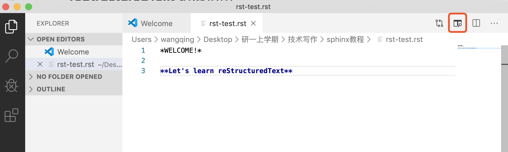

reStructuredText 语法指南
###########################
1 简介
*******
reStructuredText（可简写为RST、ReST或reST）是一种用于文本数据的文件格式，主要用于 Python 编程语言社区的技术文档。
它是Python Doc-SIG（Documentation Special Interest Group）的 Docutils 项目的一部分，旨在为 Python 创建一组类似于 Java 的 Javadoc 或 Perl 的 Plain Old Documentation（pod）的工具。Docutils 可以从 Python 程序中提取注释和信息，并将它们格式化为各种形式的程序文档。

reStructuredText 是一种轻量级标记语言，其设计目的是（a）文档处理软件（如Docutils）可以处理它，（b）读和写 Python 源代码的程序员很容易读它。而本教程介绍的 Sphinx，则是从 reStructuredText 文档生成 HTML/PDF 的工具。

学习本章 reStructuredText 语法，首先要理解两种标记元素：指令（Directives）和角色（Role）。区别在于指令是块级元素，像段落一样使用。角色是行内元素，可以写在普通文本之中。

    提示：

    1. 在第一小节 Sphinx开发环境配置中，已经介绍了如何在 Visual Studio Code 中安装reStructuredText 拓展。（补链接）请同学们开始学习本节 reStructuredText 前，确认插件已安装。
    2. 同学们在练习当中，可以随时预览 rst 文件渲染效果，检查自己书写是否正确。比如新建一个 rst-test.rst 文件，分别输入斜体文本、加粗文本，点击如下标志，可以看到已经有了相应效果：

.. image:: images/rst-preview-result.jpg

2 标题
********
章节的标题在双上划线符号之间（或为下划线）, 并且符号的长度不能小于文本的长度
reStructuredText中，没有特定的字符指定给标题级别，这是因为结构是根据继承的标题来确定的。同学们可以自行选用自己习惯的符号， # * = - ^ "，或是 = - ` : . ' " ~ ^ _ * + #，都是可以参考的标记顺序。

语法格式如下：

我展示的是一级标题
##################
使用 * + = : - 标记二、三、四、五、六级标题

我展示的是二级标题
**********************
我展示的是三级标题
++++++++++++++++++++++
我展示的是四级标题
======================
我展示的是五级标题
::::::::::::::::::::::
我展示的是六级标题
----------------------
    注意：

    1. 标题下方标记长度需要大于等于标题文字长度；
    2. 标题级别递进是按顺序的，这一点与 Markdowm 语法不同，否则会渲染失败；
    3. 全文标题标记符号要保持一致。

3 格式
********
本节介绍 reStructuredText 中的段落和字体格式。

段落
++++++
段落是reST 文档的基本模块，是由一个或多个空白行分离形成的文本块。

普通的文本段落或块级元素之间，必须使用空行加以区分，可按两下回车继续书写。

类似Python，同一段落的所有行必须左对齐而且同一级缩进。每级缩进建议用 4 个空格，或设置 Tab 自动转为 4 个空格。

字体
++++++
reStructuredText 可以使用以下几种文字格式：

*斜体文本*

**加粗文本**

    注意：

    1. 格式标记不可相互嵌套；
    2. 星号及反引号在文本中容易与内联标记符号混淆，可使用反斜杠符号转义；如果内容需要特殊字符分隔，可使用反斜杠转义，如: ``thisis\ *one*\ word.``
    3. 文本与格式标记符号之间不要留空格， ``* text*`` 不能实现渲染效果；

脚注
+++++
在文档中添加脚注，文内使用 `[#name]_` 标注脚注，文末使用 `.. rubric:: Footnotes` 添加脚注的内容。比如：
Let's learn reStructuredText [#1]_ !
You'll see a footnote.

.. rubric:: Footnote

.. [#1] reStructuredText 是一种轻量级标记语言.

此外，也可以明确用数字标注脚注，或者不指定 name，使用自动数字标记脚注 `[#]_`。# 有自动数字标记的功能，同学们接下来学习列表时也会注意到这一点。

4 列表
********
官方文档介绍了多种列表形式，同学们在学习的时候可以优先掌握前两种，其余形式可以在应用时对照书写。

无序列表 Bullet lists
+++++++++++++++++++++
无序列表使用星号(*)、加号(+)或是减号(-)作为列表标记：

* 第一项
* 第二项
* 第三项

+ 第一项
+ 第二项
+ 第三项

- 第一项
- 第二项
- 第三项

有序列表 Enumerated lists
+++++++++++++++++++++++++
有序列表使用数字并加上 . 号来表示：

1. 第一项
2. 第二项
3. 第三项

如果项很多，可以通过使用标志 # 自动编号有序列表，可以和数字混用：

#. 第一项
#. 第二项
#. 第三项

定义列表 Definition lists
+++++++++++++++++++++++++
定义列表第一行写 term，换行即可，不需要空行，缩进一级书写内容。

以下几种列表形式均可以使用自己的 term，写出不同形式的列表，term 不能有一个以上的文本行，比如：

what
    第一项
how
    第二项

***缺中文名*** Field lists
++++++++++++++++++++++++++
使用 :term: 和 :term:，项紧接着书写，比如：

:what: 第一项
:how: 第二项

选项列表 Option Lists
+++++++++++++++++++++++
term 与后面具体内容之间留出两个或以上空格：

-a  选项一
-b  选项二

又比如：

-CAT  描述二
-TC   描述一

列表嵌套
+++++++++
列表嵌套与 Markdown 语法类似，子列表中的选项添加四个空格（一个Tab），但父列表与子列表要以空行分隔：

1. 父列表第一项
2. 父列表第二项

    * 子列表第一项
    * 子列表第二项

3. 父列表第三项

5 代码
********
单行代码
++++++++
通过反引号实现： ``text``  

代码区块
++++++++
在段落后使用两个连续英文引号标记 :: 引出原始文本块。代码块段落缩进，多行代码中间不需要空行，与其他文本前后空行分隔，最后有空行，缩进退回到 :: 的位置，就表示退出原始文本块。

第一段文本 ::

   代码区块演示
   展示源代码，不会***渲染***。

第二段文本

    提示：在 reStructuredText 中，:: 是很神奇的标记：

    1. 如果 :: 标记作为独立段落存在，则整段都不会出现在文档里.
    2. 如果 :: 标记前面有空白，标记将被删除。
    3. 如果 :: 标记前面非空白，标记会被单个冒号取代。

块级代码与代码高亮
++++++++++++++++++++
原始文本块不会转换内部的字符，如果有时候需要写源代码，希望能高亮显示，就需要使用块级代码。

基本语法格式为： ``.. code:: 语言名`` ，如：

::

    .. code:: php

        <?php
            if(1 == 1){
                $joke = "Life is short, not int.";
            }
        ?>

关于代码高亮支持列表可以查看https://pygments.org/languages/，详细用法可以查看https://pygments.org/docs/lexers/

6 引用
*******
在reStructuredText中，引用有两种方式，但无论哪一种，引用中都不能使用标题。

引用纯文本
++++++++++
引用一段纯文本，可以直接使用 :: ，标记方式类似上一小节的代码：

:: 

    引用文本

引用带格式文本
++++++++++++++
如果想在引用里也使用 reStructuredText 的语法标记，仅仅缩进就可以实现，引用会自动换行：

    引用文本，可以 *包含渲染* 

7 链接
******
外部链接
+++++++++
直接粘贴网址，两端用空格和文本隔开，reStructuredText 会自动把网址转成超链接。如：http://www.ss.pku.edu.cn

更推荐的形式是用锚文本来显示一个链接，用尖括号包裹网址，放在文本后面，同样注意隔一个空格，用一对反引号包裹它们，结尾跟一个下划线。基本标记格式为：

`链接文本 <网址>`_ 

比如 `Sphinx官网 <http://www.sphinx-doc.org/en/master/>`_

`reStructuredText 详细说明 <https://docutils.sourceforge.io/docs/ref/rst/restructuredtext.html#sections>`_

内部链接
++++++++++
内部链接是通过 Sphinx 提供的一个特殊的 reST role 来实现的。每一级标题都会变成一个锚，可以创建跳转到此位置的连接。比如回到外部链接所所在位置学习，语法格式为：

外部链接_

如果标题当中含有空格，则需要使用反引号将标题括起来。比如回到“5 代码“一节学习，语法格式为：

`5 代码`_

    提示：同学们使用不同种类的链接时，可以统一使用反引号包裹，记忆负担较小。

8 图片
*******
图片是块级元素，要单独成段，一般不能嵌入行内。建议优先使用源文件的相对路径。图像指令应为：

`.. image:: 路径/文件名`
   
文件名必须是源文件的相对路径，如果是绝对路径则以源目录为根目录. 此外，添加图片的形式也可以以网址链接形式添加。

图片后还可以加入一些额外选项，比如大小选项宽度（width）和高度（height）。如果没有单位或单位为像素, 给定的尺寸信息仅在输出通道支持像素时才有用，如输出LaTeX 没用；其他单位(如 pt)在输出HTML、LaTeX 时被用到.添加选项的格式如：

    .. image:: picture.jpeg
       :height: 100px
       :width: 200 px
       :scale: 50 %
       :alt: alternate text
       :align: right
   
Sphinx会自动将图像文件拷贝到输出目录中（例如HTML格式输出，会拷贝到 _static 目录中。）

Sphinx 延伸了标准的文档化行为，只需在后面加星号::

 `.. image:: 图片名.*` 

这样写 Sphinx 会搜索所有名字匹配的图像，而不管图像类型. 每个生成器则会选择最合适的图像. 一般，在源文件目录里文件名.* 会含有 pdf 和 png两个文件, LaTeX 生成器会选择前者，而 HTML 生成器则匹配后者.

9 表格
********
reStructuredText 主要有两种表格形式，简单表格和网格表格。

简单表格
++++++++
简单表格书写简单, 基础形式好上手。要求有多行，且第一列元素不能分行显示。

构成简单表格的标记主要是"="：用于绘制表格上方、下方框线，以及分隔标题，比如：

=====  =====  =======
  A      B    A and B
=====  =====  =======
False  False  False
True   False  False
False  True   False
True   True   True
=====  =====  =======

在此基础上，每格内容可以相应使用"-"分隔书写多行，但不支持合并单元格：

=====  =====  ======
   Inputs     Output
------------  ------
  A      B    A or B
=====  =====  ======
False  False  False
True   False  True
False  True   True
True   True   True
=====  =====  ======

如果一些单元格没有内容，需要用".."或"\"占位：

=====  =====
col 1  col 2
=====  =====
1      Second column of row 1.
2      Second column of row 2.
       Second line of paragraph.
3      - Second column of row 3.

       - Second item in bullet
         list (row 3, column 2).
\      Row 4; column 1 will be empty.
=====  =====

网格表格
++++++++
网格表格可以自定义表格的边框，更灵活，但绘制相对复杂。构成网格表格的标记有以下几种：

* "-"用于绘制横线，分隔各行； 
* "="用于分隔标题与表格主体，但标题可有可无，视情况而定； 
* "|"用于绘制竖线，分隔各列； 
* "+"用在行与列的交界处。

网格表格支持合并单元格，内部也可以嵌套列表。官方示例囊括了这些细节：

+------------------------+------------+----------+----------+
| Header row, column 1   | Header 2   | Header 3 | Header 4 |
+========================+============+==========+==========+
| body row 1, column 1   | column 2   | column 3 | column 4 |
+------------------------+------------+----------+----------+
| body row 2             | Cells may span columns.          |
+------------------------+------------+---------------------+
| body row 3             | Cells may  | - Table cells       |
+------------------------+ span rows. | - contain           |
| body row 4             |            | - body elements.    |
+------------------------+------------+---------------------+

    提示：纯手打表格比较麻烦，书写中文内容标记难以对齐。如果精力允许，同学们也可以尝试 Emacs 编辑器绘制网格表格。

列表表格
+++++++++
此外，还有一种特殊的列表表格，通过创建一组嵌套的列表来渲染成表。父级列表是行，每一行的子列表是列，每行的列数必须一致（不支持合并单元格），缺少的格要用空出占位。比如：

.. list-table::
    
    * - 单行代码
      - 代码区块
      - 代码高亮
    * - 简单表格
      - 网格表格
      - 列表表格
    * - 外部链接
      - 内部链接
      - 

显示效果如下：

10 高级技巧
************

参考文档
********
更多详细说明，请参考 `reStructuredText官方文档 <https://docutils.sourceforge.io/rst.html#reference-documentation>`_ 。