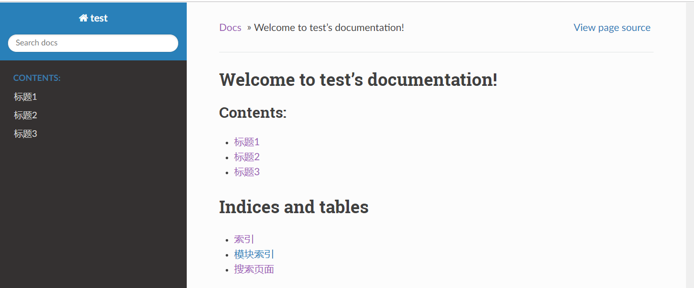
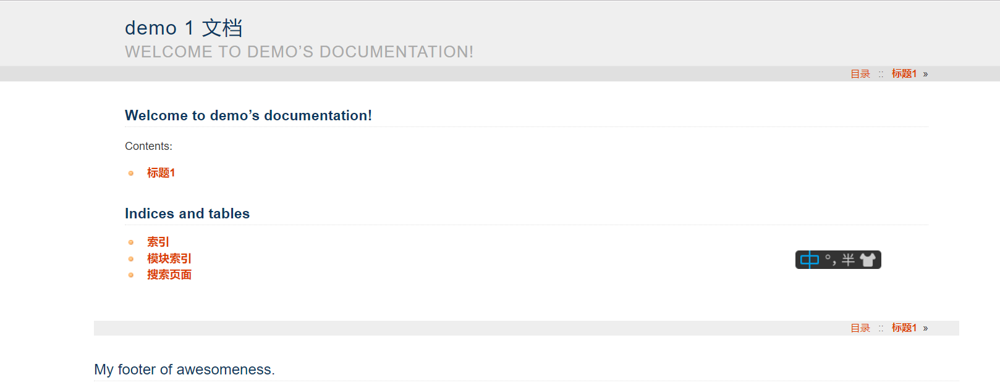

# Sphinx定制主题

##  使用既定主题

下载 Sphinx 后，其安装包中便含有名为 "themes" 的文件夹，里面包含的则是Sphinx自带的模板，包括  "epub"、"agogo" 等，而我们只需要简单的步骤，便可以使用其自带的模板：

### 修改配置文件

假设我们想使用 "haiku" 主题，则需要在 "conf.py" 中进行如下设置：

     html_theme = "haiku"

### 生成网页

命令行中再次输入 `make html`, 即可生成相应主题的网页（"test" 是我的Sphinx文件所在的文件夹）：

     C:\Users\hp\Desktop\test>make html

而其实，Sphinx中最常使用的主题是 [sphinx-rtd-theme](https://sphinx-rtd-theme.readthedocs.io/en/latest/)，但是在 "themes" 文件夹里却没有，因此我们需要先安装该主题，再进行设置。

### 安装主题模板

     C:\Users\hp>pip install sphinx-rtd-theme

出现如下代码段即可表示安装成功：

	  Installing collected packages: sphinx-rtd-theme
	  Successfully installed sphinx-rtd-theme-0.4.3

### 修改配置文件：

我们需要在 "conf.py" 中进行如下设置：

    html_theme = 'sphinx_rtd_theme'

### 生成网页

 命令行中再次输入 `make html`, 即可生成相应主题的网页：

     C:\Users\hp\Desktop\test>make html

##  用户自定义主题
Sphinx里面的模板是已经定义好了的，但是如果我们想修改样式、添加内容该怎么办呢？

### 增添内容
如若想对主题增添内容，那我们需要使用 ***jinja2*** 语言， ***jinja2*** 是 ***Flask*** 作者开发的一个模板系统，起初是仿 ***django*** 模板的一个模板引擎，为 ***Flask*** 提供模板支持，由于其灵活，快速和安全等优点被广泛使用。

在sphinx中使用 ***jinja2***，可以在继承原有主题的基础上，对网站内容进行增添改写。

####  安装 ***jinja2***
命令行中输入 `pip install jinja2 `，如下所示：

     C:\Users\hp>pip install jinja2

出现如下代码块即表示安装成功：

     Installing collected packages: jinja2
     Successfully installed jinja2-2.10.3

#### 创建 “layout.html”
我们需要在文件夹里找到 "source"-"templates"文件夹，然后在 templates" 文件夹下创建 “layout.html”.

使用 ***jinja2*** 在 "layout.html" 中编写如下代码：（jinja语言讲解待定）此段代码在网页底端加入了 *My footer of awesomeness* 这句话。

     {# Import the theme's layout. #}
     
    
     {# Add some extra stuff before and use existing with 'super()' call. #}
     
     <h2>My footer of awesomeness.</h2>
     {{ super() }}
     

#### 修改配置文件

与此同时，我们需要在 "config.py" 中进行如下设置：

     templates_path = ['_templates']

#### 生成网页
点击保存后，重新在命令行中键入  `make html`，即可生成如下网页：

### 修改样式

