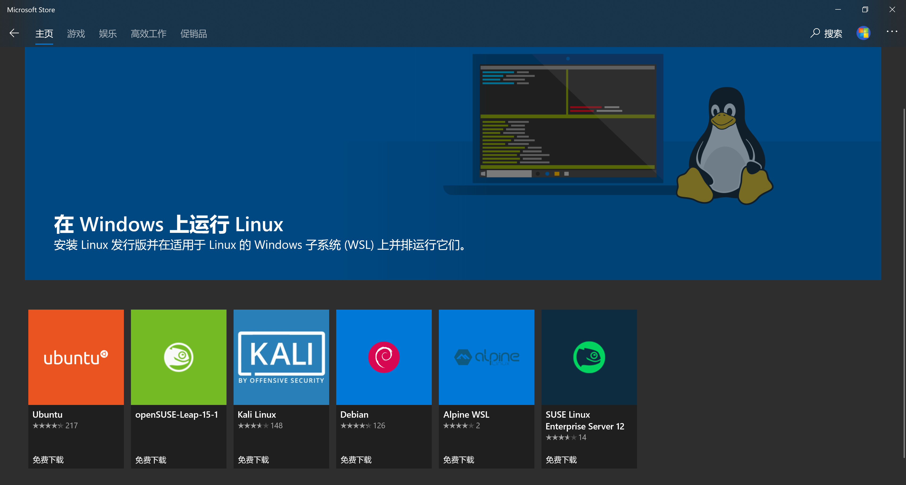
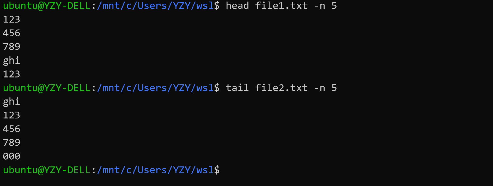
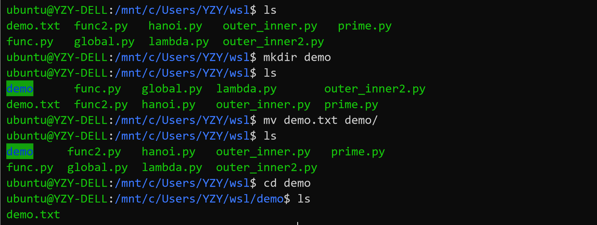
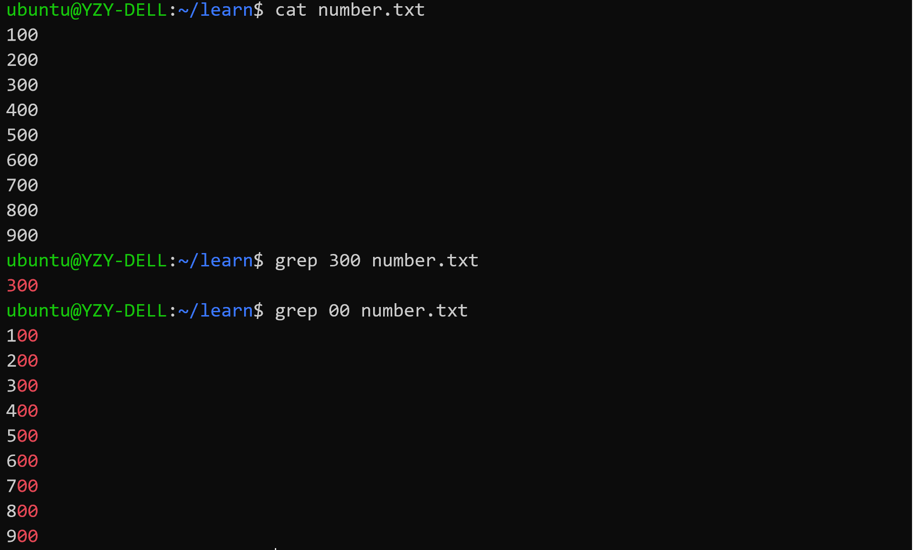
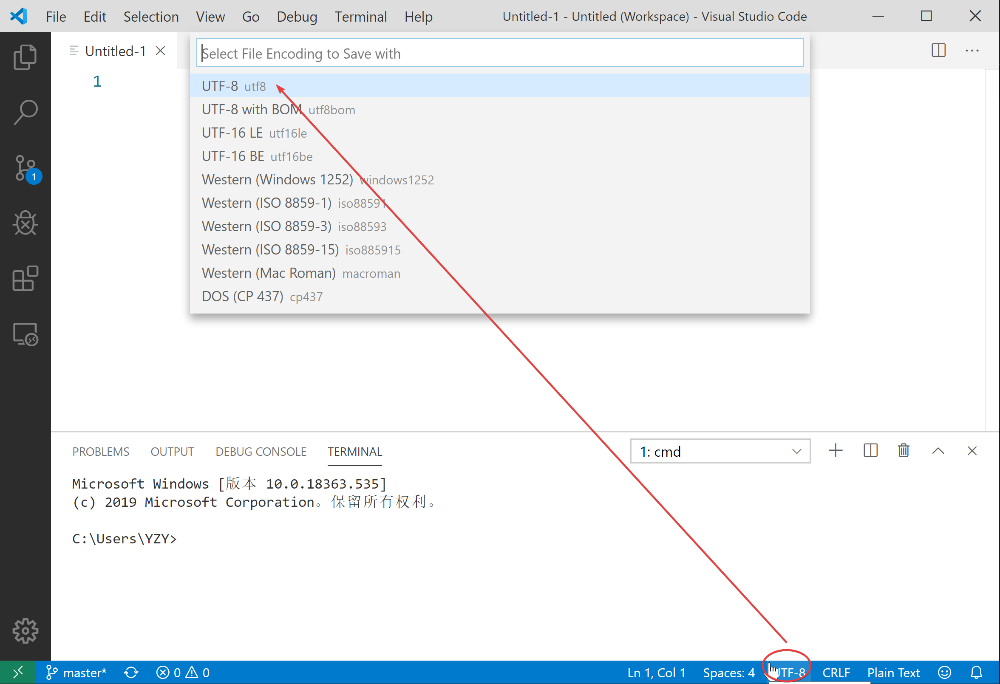
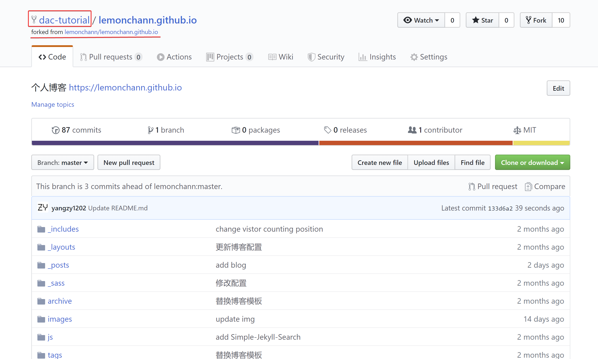
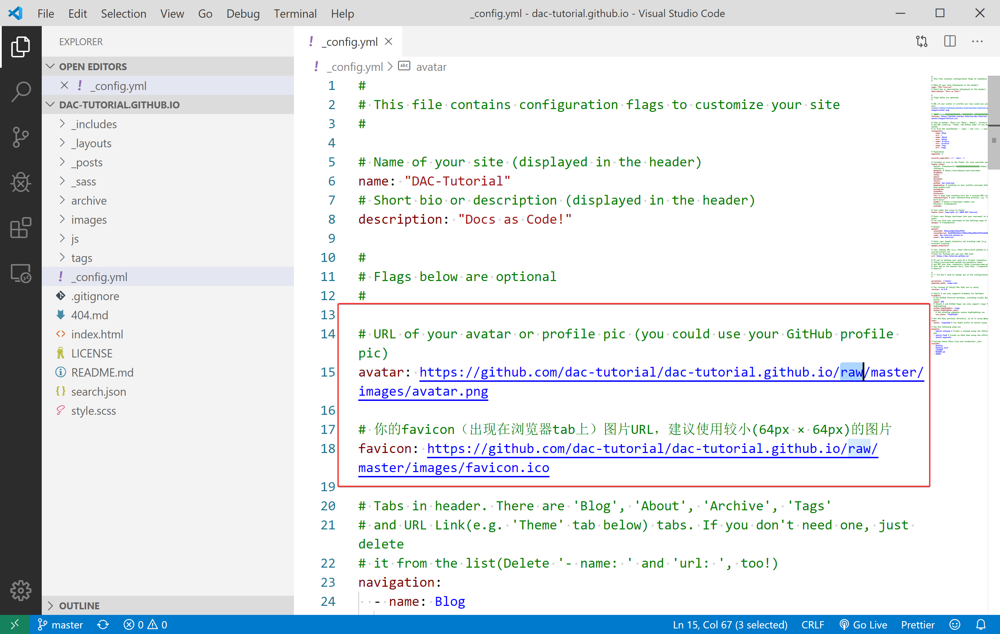

# 拓展：Jekyll 博客搭建

> **提示：** 在学习此部分内容之前，希望同学们已经了解如何管理 GitHub 远程仓库，并且能够熟练使用 VS Code 代码编辑器与 Markdown 标记语言（本教程的博客上有一个 [Markdown 简明教程](https://dac-tutorial.github.io/Markdown-%E7%AE%80%E6%98%8E%E6%95%99%E7%A8%8B/)，欢迎同学们学习！），对这些内容还不太熟悉的同学请先复习一下教程前面章节的相应内容，然后再学习开始此专题。

欢迎同学们继续学习本教程！这是本教程的最后一个学习专题，也是整个教程的最后一章！

本专题将会向大家介绍如何使用 Jekyll 搭建免费的个人博客，经过这一段时间的学习，相信同学们一定有了不少学习心得与感悟，何不将他们记录下来，与大家一同分享、一同进步呢！

## Jekyll 简介

Jekyll 是一个基于简单、可扩展的静态网站生成器，提供了模板、变量、插件等功能。Jekyll 的核心是一个文本转换引擎。它的方便之处在于支持多种文本标记语言：Markdown，Textile，HTML，然后 Jekyll 就会帮你加入你选择主题的样式的布局中，最终生成你自己的静态博客网站。

Jekyll 可以运行在 [GitHub Pages](http://pages.github.com/) 上，也就是说，你可以使用 GitHub 的服务来搭建你的项目页面、博客或者网站，而且是完全免费的。下面我们将从 Jekyll 开发环境的配置开始，逐步完成基于 GitHub Pages 的个人博客搭建！

> **参考资料：**
>
> + [Jekyll | Docs](https://jekyllrb.com/docs/)
> + [GitHub Help | About GitHub Pages and Jekyll](https://help.github.com/en/github/working-with-github-pages/about-github-pages-and-jekyll)
> + [Microsoft Docs | Windows Subsystem for Linux (WSL)](https://docs.microsoft.com/windows/wsl/about)

## 配置 Jekyll 开发环境

Jekyll 是一个 [Ruby Gem](https://www.jekyll.com.cn/docs/ruby-101/#gems) 组件，支持各大主流的操作系统平台，详情参阅 [Jekyll 官方文档](https://jekyllrb.com/docs/installation/)。

下面我们以 Windows (Windows Subsystem for Linux) 为平台介绍 Jekyll 环境的搭建方法，在 Linux/Unix/macOS 等操作系统下的配置 Jekyll 环境的方法大致相同。

> **提示：** 使用 WSL 配置 Jekyll 环境与在标准的 Linux 平台下配置 Jekyll 基本相同，本节介绍的安装配置 Jekyll 的方法大部分可直接应用在 Linux 平台上。

### WSL-Ubuntu 安装与配置

Windows 并未得到 Jekyll 官方的正式支持，但是也可以通过合适的方法使 Jekyll 运行在 Windows 平台上。在 Windows 10 之前，在 Windows 上搭建 Jekyll 开发环境比在 Linux/Unix/macOS 上要麻烦不少，并且有时会遇到一些难以预料的错误。

新版 Windows 10 提供了一项令人惊喜的新功能——Windows Subsystem for Linux（WSL），微软公司将其译作为 “适用于 Linux 的 Windows 子系统”。WSL 可以让开发人员在 Windows 10 下原生运行 GNU/Linux 环境（包括大多数命令行工具、实用工具和应用程序），且不会产生虚拟机开销。

下面介绍如何在 Windows (Windows 10 Fall Creators Update 和更高版本) 启用 WSL 的方法：

> **注意：** WSL 不适用于运行图形用户界面，将以独占方式使用命令行。

#### 启用 “适用于 Linux 的 Windows 子系统” 可选功能

⑴ 以管理员身份打开 PowerShell 并运行：

```powershell
Enable-WindowsOptionalFeature -Online -FeatureName Microsoft-Windows-Subsystem-Linux
```

⑵ 出现提示后，重启计算机即可。

#### 获取 Linux 分发版 (Ubuntu)

⑴ 打开 Microsoft Store，搜索 "Linux” ，选择 Ubuntu



⑵ 在分发版的页面中，选择“获取 (Get)”，然后“安装 (Install)”


#### 初始化 Linux 分发版 (Ubuntu)

安装 Linux 分发版后，必须先初始化一次后才能使用，步骤如下：

⑴ 启动 WSL，首次运行新安装的分发版时，会打开一个控制台窗口，其中指出需要等待一两分钟时间来完成安装。

⑵ 安装完成后，系统会提示创建新的用户帐户（及其密码）

> **注意：**
>
> - 此用户帐户用于启动分发版时默认登录的非管理员用户，它与 Windows 用户名无关。
> - 打开新的分发版实例时，系统不会提示你输入密码，但**如果使用 `sudo` 提升了进程的权限，则需要输入密码**
> - Linux/Unix 在输入密码的时候不会有任何提示，Unix的哲学是“没有消息就是好消息”！

#### 更新和升级 Linux 分发版 (Ubuntu)

+ Windows 不会自动更新或升级 Linux 分发版，需要使用 Linux 分发版的包管理器升级已安装的包，建议定期更新。

+ 在 Debian/Ubuntu 终端中使用 `apt` 命令，并确认更新和升级分发版的包：

  ```bash
  sudo apt update && sudo apt upgrade
  ```


#### 附录：Linux 基础命令

打开 WSL - Ubuntu 命令行窗口，试一试以下 Linux 命令：

> 命令行也被称为 Bash Shell、终端、控制台、命令行接口 (CLI)，或对于 Windows 更常见的命令提示符，这些术语常常互换使用。


+ `pwd` 命令：当前工作目录

+ `clear` 命令：清空当前屏内容

+ `cd` 命令：切换目录（Linux 中的根目录被称为`root`目录，使用`/`表示）

+ `ls` 命令：查看当前目录下的文件（可使用`ls -l`查看文件详情）


+ `mkdir` 命令：创建文件夹

+ `rmdir` 命令：删除文件夹（需要先切换至上层目录，键入几个字符后按 Tab 键会自动完成文件名或路径。）


+ `cp` 命令：复制文件


+ `cat` 命令：查看文本内容


+ `diff` 命令：查看文件差异（修改`file2.txt`后比较）


+ `head` 命令：查看文件头（可加参数`-n`）

+ `tail` 命令：查看文件尾（可加参数`-n`）



+ `wc` 命令：统计字符（默认为：`<行数-l> <单词数-w> <字符数-c> <文件名>  `，可加参数限定）


+ `rm` 命令：删除文件（注意：Linux 没有 “回收站” 机制，直接使用`rm`要谨慎）


+ `mv` 命令：移动文件或重命名文件（注意：文件夹名也是大小写敏感的！）




+ `less` 命令：浏览文件（可移动光标），点击字母`q`退出


+ `chmod` 命令：修改文件读写权限

> `chmod` 命令分为三部分：u作者，g小组成员，o其他成员；每一部分里面都有：r读，w写，x运行三个部分；如果想修改权限的话 chmod u-r 文件名称 代表修改了作者的权限，不能够读。如果想添加权限 chmod u+r 文件名称 代表允许可读权限。如果使用 chmod g-r 文件名称 代表小组成员和其他人都不能读。`chmod` 也可以通过二进制数（转十进制）进行操作


16. `grep` 命令：对文本文件进行搜索

> `grep` 命令可以对文本文件的内容进行搜索，使用正则表达式，能够更好的查找想要的内容，还可以使用命令组合来实现更好的定位。




### 使用 VS Code 创建 WSL 集成开发环境

VS Code 内置的命令行可以将它与 WSL Linux 发行版本集成，同时在代码编辑器与 Bash 和 PowerShell 工具之间建立无缝工作流（请在安装 VS Code 时将 VS Code 添加至 path）。

#### 安装适用于 Windows 的 VS Code 和 Git

⑴ 下载适用于 Windows 的 VS Code：[https://code.visualstudio.com](https://code.visualstudio.com/)。

⑵ 首次打开 VS Code 时，可能会看到以下错误消息：“找不到 Git。请使用“git.path”设置来安装或使用它。” 请从 git-scm 网站下载并安装适用于 Windows 的 Git：https://git-scm.com/download/win，为 VS Code 工作区中的“源代码管理”面板提供技术支持。

#### 安装 Remote - WSL 扩展

在 VS Code 中，打开“扩展”视图（选择 “查看” - “扩展” 或按 `Ctrl+Shift+X` 并搜索 “wsl”。 选择如下所示的 “Remote - WSL” 扩展（应位于列表顶端）并按 “安装”。


使用 Remote - WSL 扩展，可以在 WSL 的上下文中使用 VS Code 编辑器，享受对 IntelliSense、代码导航、调试等语言功能的完整支持。 还可以选择安装[远程开发扩展包](https://marketplace.visualstudio.com/items?itemName=ms-vscode-remote.vscode-remote-extensionpack)，其中捆绑了全部三个 VS Code 远程扩展，除 WSL 外还支持在 Docker 容器内通过 SSH 工作。

#### 将默认终端 Shell 更改为 WSL

在 VS Code 中，选择“视图” > “终端”（或选择使用反撇号字符的 Ctrl+`）。 将在 VS Code 窗口的底部打开命令行（或终端 shell）窗口。 通过此窗口可以运行各种命令行工具，而无需离开 VS Code。

VS Code 的默认终端是 PowerShell，若要更改默认 VS Code 终端 Shell，请打开终端下拉列表并选择“选择默认 Shell”。 将打开包含可用 Shell 列表的“设置”窗口。 选择列表中的“WSL Bash”。 （也可从命令面板打开默认终端选取器，选择 F1 键并输入“终端: 选择默认 Shell”。）


#### 文件存储位置

Windows 和 Linux 文件存储在不同的目录中， 建议将项目文件保存到 Windows 用户主目录中。通过此设置，Windows 应用（包括 VS Code）可以访问和操作这些文件，同时你也仍能从 Linux 终端访问它们。

> **注意：** 
> 
> + 存储在 `C:\Users\\` 中的所有文件都将映射到 WSL 发行版中的以下位置：`/mnt/c/Users/`；
> 
> + 不得在 Windows 应用内编辑 WSL 根目录中的文件。
> 
> + 在 Jekyll 中使用 UTF-8 编码时，请务必确保文件不含 `BOM` 标签！可以在 VS Code 中查看以及修改编码格式：
> 

### 使用 WSL-Ubuntu 安装 Jekyll

安装当前最新版本的 Jekyll V4.0.0 有以下前提条件：

- [Ruby](https://www.ruby-lang.org/en/downloads/) **2.4.0** 或更高版本，包含所有用于开发的头文件（可通过执行 `ruby -v` 指令检查 ruby 版本）
- [RubyGems](https://rubygems.org/pages/download) （可通过执行 `gem -v` 指令检查版本）
- [GCC](https://gcc.gnu.org/install/) and [Make](https://www.gnu.org/software/make/) （以防你的系统中没有安装这些工具，请通过执行 `gcc -v`,`g++ -v` 和 `make -v` 指令进行检查）

#### 安装 Ruby

打开 WSL-Ubuntu 命令行窗口，分别执行以下命令：

```bash
sudo apt-add-repository ppa:brightbox/ruby-ng
sudo apt-get update
sudo apt-get install ruby2.5 ruby2.5-dev build-essential dh-autoreconf
```

> **注意：** 我们将会使用到一个 [BrightBox](https://www.brightbox.com/docs/ruby/ubuntu/) 的资源库，该库包含了为 Ubuntu 的 优化的 Ruby。

#### 更新 Ruby gems

在 WSL-Ubuntu 命令行窗口中执行以下命令，更新 Ruby gems：

```bash
gem update
```

#### 安装 Jekyll

在 WSL-Ubuntu 命令行窗口中执行以下命令，安装 Jekyll 相关包：

```bash
gem install jekyll bundler
gem install jekyll-sitemap
gem install jekyll-feed
gem install jekyll-paginate 
```

#### 检查 Jekyll 安装

在 WSL-Ubuntu 命令行窗口中执行以下命令：

```bash
jekyll -v
```

如果 Jekyll 已安装在 WSL-Ubuntu 环境中，应该会显示当前安装的 Jekyll 版本：


#### 附录：Jekyll 常用命令

- `jekyll new PATH` - 使用基于 gem 的默认主题在指定目录中创建一个全新的 Jekyll 站点。必要的目录也会被自动创建。
- `jekyll new PATH --blank` - 在指定的目录下创建一个全新的空的 Jekyll 站点框架。
- `jekyll build` 或 `jekyll b` - 执行一次构建，并将生成的站点输出到 `./_site` （默认） 目录
- `jekyll serve` 或 `jekyll s` - 源文件更改时构建站点并提供本地访问服务
- `jekyll doctor` - 输出任何不推荐功能或配置方面的问题
- `jekyll clean` - 删除所有生成的文件：输出目录、元数据文件、Sass 和 Jekyll 缓存。
- `jekyll help` - 显示帮助信息，也可以针对特定子命令显示帮助信息，例如 `jekyll help build`
- `jekyll new-theme` - 创建一个新的 Jekyll 主题框架

### 小练习：第一个 Jekyll 站点

#### 创建 Jekyll 项目目录

在 Windows 合适的位置新建一个 `myblog` 文件夹，按住 <kbd>shift</kbd> 对此文件夹单击鼠标右键，选择 “在此打开 Linux Shell”


在打开的 WSL-Ubuntu 命令行窗口中，使用 `code .` 命令在 VS Code 中打开此目录，并激活 VS Code 的 WSL 终端：


#### 添加 index.html 文件

使用 VS Code 在 ***myblog*** 目录下新建一个 ***index.html*** 文件，填写以下内容，并保存：

```html
<!doctype html>
<html>
  <head>
    <meta charset="utf-8">
    <title>Home</title>
  </head>
  <body>
    <h1>Hello World!</h1>
  </body>
</html>
```


#### 发布 Jekyll 测试站点

现在可以使用 Jekyll 发布我们的测试站点了，有两种命令可用于来发布站点：

- `jekyll build` -  生成站点，并将静态站点输出到名为`_site`的目录.
- `jekyll serve` - 生成站点，并运行一个本地 Web 服务器，可在浏览器中通过`http://localhost:4000`访问改站点，任何对源文件的修改都将会重构站点的内容。

通常在本地开发时使用`jekyll serve` 命令，而`jekyll build`命令用来为生产环境构建站点。

请按照以下步骤发布一个 Jekyll 测试站点：

⑴ 在 VS Code 的 WSL 终端中执行 `jekyll serve` 命令：


⑵ 在浏览器中转到 `http://localhost:4000`——Hello World!


⑶ 在 VS Code 中的 ` <h1>Hello World!</h1>` 下添加一行：

```html
<h2>Hello Jekyll!</h2>
```


⑷ 在浏览器中刷新一下当前页面，看看发生了什么：


## 使用 Jekyll 搭建个人博客

> **注意：** 本节部分内容参考了知乎用户[柠檬橙](https://www.zhihu.com/people/ll-chen-2)的文章[《可能是最全面的github pages搭建个人博客教程》](https://zhuanlan.zhihu.com/p/94121927)，感谢他的热心分享！

传统上，使用 Jekyll 搭建博客站点的一般流程大致如下：

- 首先，在本地使用`jekyll new PATH` 创建一个 Jekyll 项目；
- 接着，往项目目录中添加 HTML、CSS、Markdown 等内容，并调整模板设置；
- 然后，使用 `bundle exec jekyll serve` 将网站发布到本地 Web 服务器；
- 最后，在 `http://localhost:4000` 上调试完成后，上线博客站点。

以上流程需要使用者具有一定的 Git 和 HTML/CSS 基础，然后花不少时间才能做出一个优雅、漂亮的博客站点。但随着 GitHub 开始原生支持 Jekyll，越来越多的 Geek 开始使用 GitHub Pages 搭建个人博客，并将主题模板作为公共仓库向他人开放，现在使用 Jekyll 搭建基于 GitHub Pages 的博客站点已变得十分简单、高效。

下面将向大家介绍如何利用 Jekyll 搭建一个基于 GitHub Pages 的简易博客站点。

### 创建博客仓库

首先，我们需要建设一个用于我们博客站点的 GitHub 仓库，名称必须是：`username.github.io` 这里的 **username** 指的是 GitHub 用户/组织的帐户名称，这个地址将会成为博客站点的网址。例如，本教程博客对应的 GitHub 仓库名称就是 `dac-tutorial.github.io`。

> **提示：** 仓库的名称不是 `username.github.io` 也可以启用 GitHub Pages 功能，但会作为 `username.github.io` 的子站点， 实际上，你可以认为 `username.github.io` 是 GitHub 分配给你的默认域名，同名仓库即代表着网站首页，其他仓库则是网站的其他内容。例如，你可以通过 <https://dac-tutorial.github.io/sphinx-html-demo/> 访问到本教程在之前章节中作为示例的一个 Sphinx 测试站点。

如下图所示，我们可以新建一个名为`username.github.io` 的，建议勾选上 `Initialize this repository with a README` 用来做此仓库的说明文件。（你甚至可以使用 Jekyll 把它转换成整个博客站点的首页！）


之后，我们可以将此仓库 clone 到本地然后，使用我们先前搭建的 Jekyll 开发环境将其逐步完善后发布博客站点。

不过，一个更加简单、高效的方式是直接在 GitHub 上 fork 其他人公开的博客站点仓库，然后在其基础上进行修改和补充。知乎用户[柠檬橙](https://www.zhihu.com/people/ll-chen-2)在其文章[《可能是最全面的github pages搭建个人博客教程》](https://zhuanlan.zhihu.com/p/94121927)里向大家分享了他使用 Jekyll 搭建的 [GitHub 博客仓库](https://github.com/lemonchann/lemonchann.github.io)，在他的仓库页面点击 **fork**，将他的仓库 **fork** 到我们的账号下（同学们也可以 **fork** [本教程的博客站点仓库](https://github.com/dac-tutorial/dac-tutorial.github.io)）：


然后，我们可以在账号下看到一个 **fork** 自 [lemonchann/lemonchann.github.io](https://github.com/lemonchann/lemonchann.github.io) 的仓库：



接着，进入此仓库的 Settings 页面，将仓库名称修改为自己的用户名：


现在，我们可以在浏览器中转到 “自己” 的[博客站点](https://dac-tutorial.github.io/)看看，其内容应该和 [lemonchann/lemonchann.github.io](https://github.com/lemonchann/lemonchann.github.io) 完全相同。


### 修改博客配置

经过前一小节的操作，我们通过 `fork` 快速创建了[博客仓库](https://github.com/dac-tutorial/dac-tutorial.github.io)，但现在其配置和内容都还是原作者的，我们需要进行一些修改。使用 GitHub Desktop 将仓库 clone 至本地后，将 `_posts` 目录清空，删除 `images` 目录下除了 `404.jpg` 外的其他文件。然后打开博客的配置文件 ***_config.yml*** 文件，它位于博客根目录下，我们需要修改以下内容：

+ **博客名称和描述：** 将 name 和 description 修改为自己的信息。


+ **博客头像和标签图标：**配置博客的头像 (avatar) 和显示在浏览器标签页前面的小图标 (favicon) ，大家可通过搜索引擎寻找自己喜欢的资源，并将其保存在 images 目录下，然后修改相应配置。



> **注意：** 使用 GitHub 当作图床时要将地址中的 blob 替换成 raw！

+ **页尾链接：** 可配置一些社交链接按钮（未配置将不显示），原作者配置了知乎、邮箱、GitHub 账号三个，我们这里只配置了一个 GitHub 账号，你也可加自己其他的社交帐号。


+ **页尾文本：** 可填入一些位于社交链接按钮下的短文本，常常是版权申明之类的。


+ **Gitalk: ** GitHub Pages 只支持静态文本，如果需要为博客配置评论等功能需要使用额外的插件，Gitalk 就是一种能为我们添加博客评论的一种插件，原理是利用 GitHub 的 issues 评论文章，我们使用的博客模板原作者已经添加了 Gitalk 的配置项，但我们需要对其中的内容做一些修改，规则如下：

```yaml
gitalk:
  clientID: <你的clientID>
  clientSecret: <你的clientSecret>
  repo: <你的repository名称>
  owner: <你的GitHub用户名>
```

​	其中 clientID和 clientSecret 需要我们在 [GitHub 账号设置](https://github.com/settings/applications/new) 里进行申请：


​	申请成功之后，我们会得到相应的 Client ID和 Client Secret，修改配置即可。


+ **Google Analytics：** 博客模板原作者已经还给博客添加了 Google Analytics 站长统计的配置项，这需要先注册一个 [Google Analytics](https://analytics.google.com/analytics/) 账号，它可以统计你博客网站的访问人数，访问来源等非常丰富的网站数据，我们这边先不设置这个功能，直接删除配置项的内容即可。


+ **博客网址配置：** 配置你自己的博客地址，这里使用了 GitHub Pages 的默认网址，如果你有自己的域名，也可以添加上去。


完成以上修改后，保存 ***_config.yml*** 文件，使用 VS Code 连接上我们的 WSL-Ubuntu 开发环境：


在 VS Code - WSL 终端中执行 `jekyll serve` 命令，然后打开浏览器转到 <http://localhost:4000> 预览博客内容。


> **提示：** 也可以在完成配置修改后，通过 GitHub Desktop 将修改 push 到远程仓库中，待 GitHub Pages 重构后，可直接在博客网址上看到修改后的效果，但这个方法对于调试不是很方便。

### 添加博客内容

修改完博客配置后，我们需要为我们的博客添加内容，也就是我们的的博文。所有的文章都使用 Markdown 标记语言撰写，统一存放在 **_post** 文件夹下。然后，在浏览器中转到（刷新） <http://localhost:4000>页面，就能在页面中看到新增的博文。

> **注意：** **博文必须采用统一的命名格式** `yyyy-mm-dd-blogName.md` ，比如 `2020-01-12-markdown_guide.md`


确认无误后，使用 GitHub Desktop 将修改上传到远程仓库中，待 GitHub Pages 重构后，我们就能在博客网址上看到我们的博文了。


### 其他博客功能

经过以上步骤，大家已经基本搭建好了一个个人博客站点，现在我们只需要不断添加、更新博文，以及根据需要修改博客设置就可以了。如果大家还想为自己的博客添加一些其他的功能，提升用户体验，可以参考以下几篇文章：

> + https://blog.csdn.net/u012702547/article/details/100533763
> + https://blog.csdn.net/ds19991999/article/details/81293467
> + https://blog.csdn.net/kesixin/article/details/78261535

最后，欢迎各位同学在完成本专题的学习后将你的个人博客网址发表在[本教程 GitHub 的 issues](https://github.com/dac-tutorial/DAC-Tutorial/issues) 中，与大家分享你的知识与生活！感谢大家学习本教程！