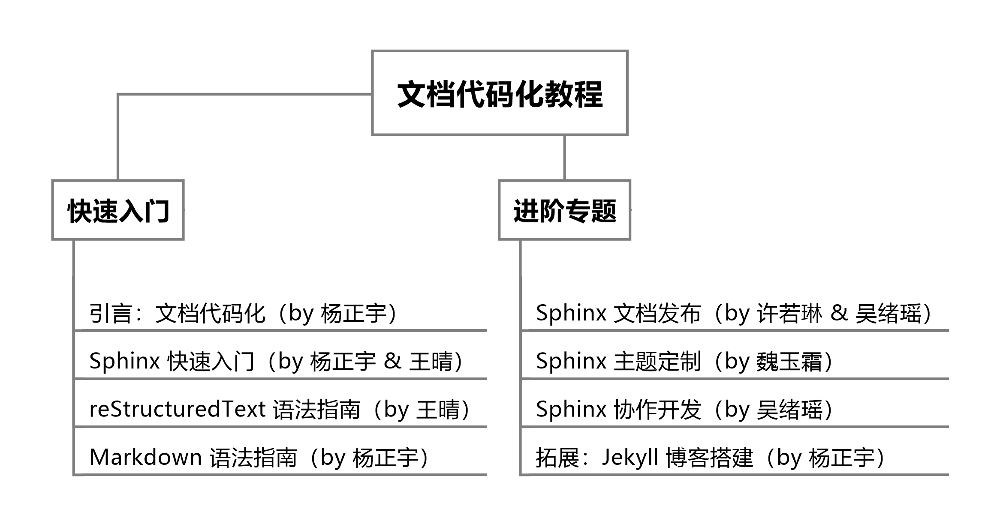

引言：文档代码化
================

`文档代码化 (Docs as Code) <http://www.writethedocs.org/guide/docs-as-code/>`_，是一种新兴的的技术文档开发模式，即使用代码开发的方式和工具进行文档开发。

文档代码化意味着将文档开发融入产品开发的工作流程，可有效节省工具成本，提升文档开发效率，并增强产品研发和文档写作的协同管理。

目前，微软、亚马逊和阿里等高科技公司已逐渐将文档代码化应用于生产实践，其文档开发流程大致包括五大步骤：

    1. 使用 Markdown、reStructuredText 等标记语言写作；
    2. 通过 Git 进行版本管理和协同写作；
    3. 使用代码开发集成环境作为写作工具；
    4. 通过文档发布工具将 Markdown、reStructuredText 文件发布为网页或PDF等格式；
    5. 收集文档的用户使用数据，不断迭代改进文档质量。

本教程主要使用 Sphinx 文档开发工具向同学们介绍了文档代码化开发的完整流程，教程大纲如下所示：

