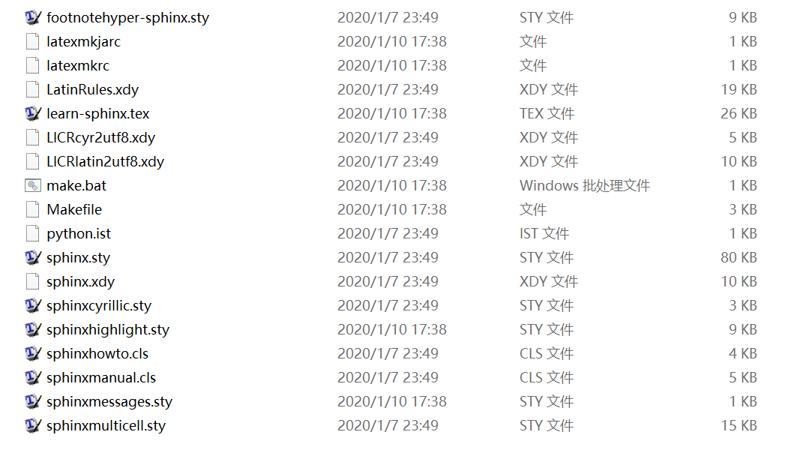
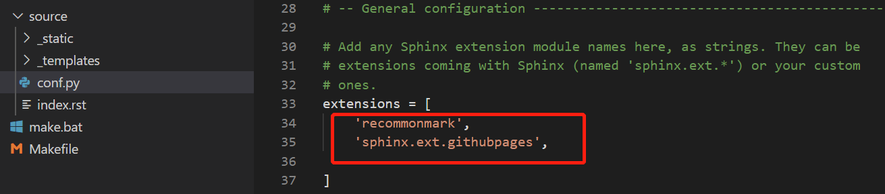

Sphinx 文档发布
=========================

Sphinx 可以为我们提供多种发布的格式，如 HTML、LaTeX、ePub、Texinfo、纯文本等。在这里我们主要为同学们介绍两种本地发布的格式与两种在线发布的格式。

本地发布
>>>>>>>>>
发布 HTML
---------------
发布 HTML 格式是 Sphinx 发布最基础的操作，如我们在学习生成 **第一个 Sphinx 项目** 时所看到的，只需在发布时使用 ``make html`` 或 ``sphinx-build -b html <sourcedir> <builddir>`` 命令即可。更多有关 HTML 主题定制的内容，请参阅后文 HTML 主题定制章节。

.. image:: images/make-html.png

发布 PDF
----------------
发布 PDF 格式的过程较为复杂，也有几种不同的途径，例如可以使用 rst2pdf 这个工具，但它只能处理较为基本的格式。当我们需要解决分页、目录、排版、换行、脚注、表格、交叉参考、插图等问题时，就可以选用 LaTeX 作为中间格式来转换 PDF。LaTeX 中的文档结构可以单独设置样式，相同的数据结构可以用不同的格式显示，并具有不同的设计。下面就为同学们介绍如何使用 rst2pdf 输出简单 PDF，以及使用 Sphinx 输出 LaTeX 格式文件，再使用 Pandoc 转换为 PDF 格式文件的方法。

1. 使用 rst2pdf 输出 PDF
^^^^^^^^^^^^^^^^^^^^^^^^^^^^^^^^^

* 在命令行中或如 VS Code 的终端中通过 ``pip install --user rst2pdf`` 下载 rst2pdf 工具。

.. image:: images/rst2pdf-download.png

* 在 ``confpy`` 文件中，将 extensions 的内容填写为 ``'rst2pdf.pdfbuilder'``。

* 进入源文件所在文件夹路径，输入 ``rst2pdf <document name> <output name>.pdf``，如 ``rst2pdf chapter1.rst chapter1.pdf``。

.. image:: images/rst2pdf-chapter1.png

**注意：** 这个过程仅涉及格式转换，若要自定义配置，需在 ``conf.py`` 文件添加相关内容。

2. 使用 LaTeX 转换 PDF
^^^^^^^^^^^^^^^^^^^^^^^^^^^^^^^^^

* 使用 Sphinx 输出 LaTeX 格式文件

首先，我们需要在 `官网 <http://tug.org/texlive/acquire-netinstall.html>`_ 或清华大学的镜像站下载并安装 TeX Live，这是一款处理 tex 格式文件的工具，目前于2019年4月发布了最新版本。安装过程可能会花费比较长的时间，可以通过安装过程对话框查看安装进度。出现以下对话框说明打开了正确的安装文件：

.. image:: images/texlive1.png

安装完成后，我们可以在命令行中输入 lex -version 来检验是否安装成功。

.. image:: images/texlive-version.png

完成后，我们就可以通过 ``make latex`` 或 ``sphinx-build -b latex source build`` 输出 LaTeX 格式文件。

如果要生成中文PDF，还需要确认安装了东亚语言包和字体包（texlive-lang-cjk, texlive-fonts-recommands等），在 ``conf.py`` 中设置 Options for LaTeX output 的 latex_elements 变量，加入如下配置，并执行输出：::

  latex_elements = {
  # The paper size ('letterpaper' or 'a4paper').
  #'papersize': 'letterpaper',

  # The font size ('10pt', '11pt' or '12pt').
  #'pointsize': '10pt',

  # Additional stuff for the LaTeX preamble.
  'preamble': '''
  \\hypersetup{unicode=true}
  \\usepackage{CJKutf8}
  \\AtBeginDocument{\\begin{CJK}{UTF8}{gbsn}}
  \\AtEndDocument{\\end{CJK}}
  ''',

* 使用 Pandoc 将 LaTeX 格式文件转换为 PDF 格式文件

`Pandoc <https://www.pandoc.org/installing.html>`_ 是一款标记语言转换工具，可实现多种不同标记语言间的格式转换。 选择此款工具的原因是它的应用场景十分广泛，在其他时候也一定能为同学们的学习工作助力。

对于当前任务，我们需要用到的语法很简单，为 ``pandoc <filename> -o <output filename>``，如 ``pandoc test.md -o test.pdf``。一般情况下，Pandoc 会根据文件名的后缀自动识别文件类型并进行相应的转换，十分方便。也可以在 ``pandoc`` 后添加 ``-s``，为聪明模式，具体说明及其他详细语法请见 `帮助文档 <https://pandoc.org/MANUAL.html#creating-a-pdf>`_。

此外，Pandoc 官网也提供了一个在线的 `转换平台 <https://pandoc.org/try/>`_，但有些格式有欠缺，感兴趣的同学可以前往尝试。

在线发布
>>>>>>>>>
使用 ReadTheDocs 进行发布
------------------------------
ReadTheDocs 是一个提供了托管服务的平台。我们可以把生成的 Sphinx 网页托管到这个平台上进行在线发布。首先我们需要在这个平台注册账号，不过也可以选择关联我们的 Github 账号。

.. image:: images/rtd-register.png

之后我们选择 ``Import a Project`` 来导入项目，如果没有自动识别，则可以点击手动导入。

.. image:: images/rtd-set-project.png

在添加项目页面，我们需要填写好项目的名称、地址等信息。在额外信息界面，我们可以补充诸如所使用的编程语言等信息。最后点击完成，即可完成导入项目过程。

.. image:: images/rtd-extra-info.png

此外，我们还可以自定义域名：
- 在域名管理中添加 DNS 的 CNAME 记录到 readthedocs.io。
- 在项目的 ``Admin`` -> ``Domains`` 中设置上一步添加的域名，开启 HTTPS，保存。

接下来，返回 Github，在项目仓库的首页右侧寻找 ``Settings`` ，进行以下操作：

- 在 ``Settings`` -> ``Options`` 的 ``Danger Zone`` 中将仓库设为公开（ ``Make Public`` ）。
- ``Settings`` -> ``Webhooks``， 一般情况下 ReadTheDocs 已自动识别好项目地址；若没有，点击 ``Add webhook`` 手动添加。

.. image:: images/add-webhook.png

- 若有需要，在项目的根目录下创建文件 ``readthedocs.yml`` 和 ``requirements.txt``，参考 ``官网 <https://docs.readthedocs.io/en/stable/config-file/v2.html>``_ 的介绍进行文件配置。 

返回 ReadTheDocs，点击 ``Build version`` 进行在线网页的发布。

现在，每当我们推送新的内容到 Github 仓库， ReadTheDocs 都会自动识别并更新文档。

使用 Github Pages 进行发布
-----------------------------------------
Github Pages 基本功能
^^^^^^^^^^^^^^^^^^^^^^^
Github Pages 官网：https://pages.github.com/

Github Pages 作为一种线上发布方式，完全免费，零成本，提供 username.github.io 的域名, 免费的静态网站服务器；集成在 Github 中, 直接和代码管理绑定在一起, 随着代码更新自动重新部署, 使用非常方便；没有数量限制, 每一个 Github repository 都可以部署为一个静态网站。

利用 Github Pages 进行基本的静态网页发布的方式有两种，一是打开 Github Pages 官网，点击 Github Repository ，会自动跳转到当前 Github 账户；同学们也可以直接登录自己的 Github 账号。

.. figure:: images/githubpages-home.jpg

进入需要发布的 Repo 界面，选择 Settings，下拉找到 Github Pages 选项

.. figure:: images/githubpages-settings.jpg

选择网页生成的来源，用户和组织站点的默认发布源是主分支。

.. figure:: images/githubpages-settings.jpg

选择合适的发布主题。

.. image:: images/githubpages-choose-theme.jpg

**注意** 这里提供的主题需要配合jekll使用才能生效。

设置完成后，显示已自动生成网页，除了通过自动生成的域名进行访问，用户也可以自定义域名。

.. figure:: images/githubpages-publish.jpg

Sphinx 与 Github Pages 发布
^^^^^^^^^^^^^^^^^^^^^^^^^^^
利用 sphinx 制作的文档可以借助 Github Pages 进行发布，具体操作如下：

正常情况下 Github Pages 只能发布由 sphinx 编译后的 html 文件包，不能直接发布 rst、md 等格式的其他文件。如果需要使用 sphinx 发布 Github Pages 兼容的 html，需要添加一个 sphinx 内置拓展 'sphinx.ext.githubpages'，具体配置如下图：

 
 配置过程中可能会报错提示未安装某些拓展包，按照提示安装即可。
  
1. 按照本教程的 **quick-start** -> **创建项目** 一节中的输出 html 文件方法输出 html 文件。Sphinx 默认的 html 主题在本教程的 **quick-start** -> **HTML 输出选项** (Options for HTML output)一节中有介绍，同学们可以回顾相关章节对内容进行复习。输出结果如下图：
 
.. image:: images/githubpages-html-output.jpg
 
2. 直接通过 Github Desktop 在本地创建新仓库（记住要命名为 username.github.io），直接导入文件中的内容。

.. image:: images/githubpages-add-exist-from-hd.jpg

3. 在左侧填写 **Summary** （此项必填），然后点击 **commit to master** 提交，并 publish repository。

.. image:: images/githubpages-publish-from-desktop.jpg

在 Github.com 中可以看到从本地成功上传的文件：

.. image:: images/githubpages-upload2github.jpg

另外，如果云端已经创建了一个名为 username.github.io 的仓库（username 指的是 Github 账户名），操作如下：

1. 先将仓库 clone 到本地。

.. image:: images/githubpages-clone-repo.jpg

可以直接选中要克隆的仓库，也可以输入仓库的 URL 进行克隆。

2. 在仓库界面按快捷键 **Ctrl+Shift+F** 或根据提示将本地的文件拷贝到仓库目录下。

.. image:: images/githubpages-show-in-explore.jpg

3. 和直接通过 Desktop 创建新仓库操作一致，提交 changes，然后点击 **publish branch** 将变动提交至云端。

.. image:: images/githubpages-publish-branch.jpg

**Tip**：上述操作可以通过 Git GUI 以及 Git Bash 实现（这两种方式此处不再描述，感兴趣的同学可以上网查找相关教程）。

4. 访问 https://username.github.io 即可看到发布的 Github Pages 静态网页。

.. image:: images/githubpages-homepage.jpg

本教程的完整文档最终也使用了 Github Pages 进行发布，具体请点击： https://dac-tutorial.github.io/tutorial-by-sphinx/.
 
操作是不是十分简单呢？同学们赶紧试试用 sphinx 生成的 html 文件发布  Github Pages 静态网页吧！
 
