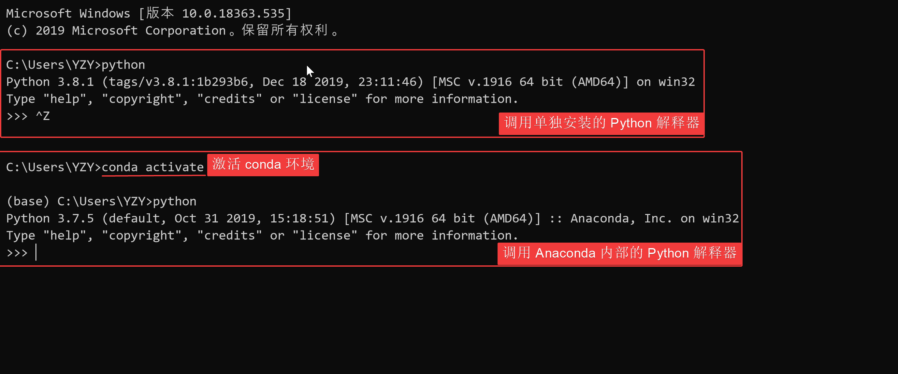
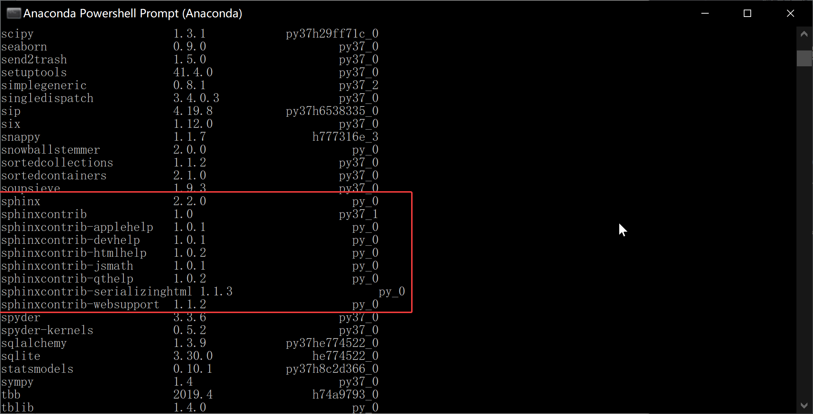
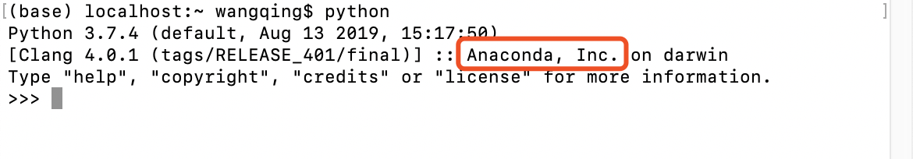
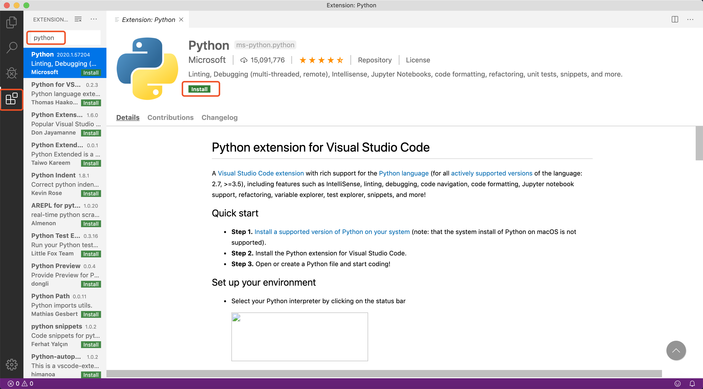
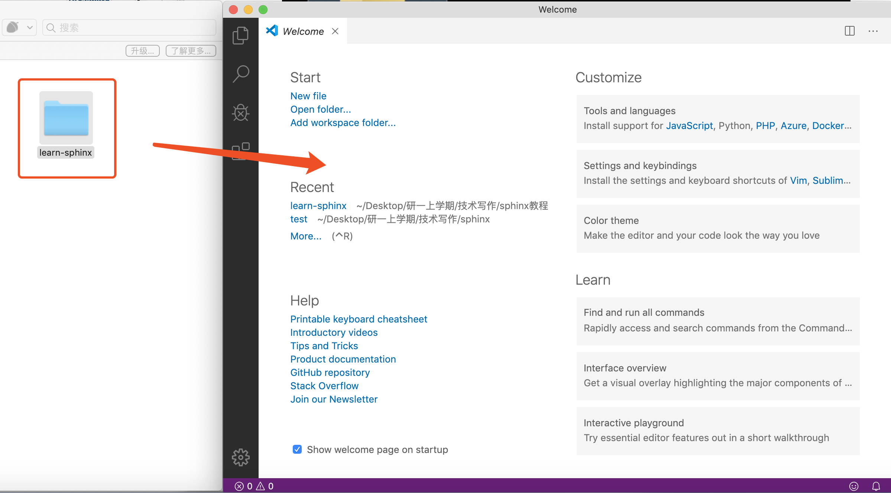
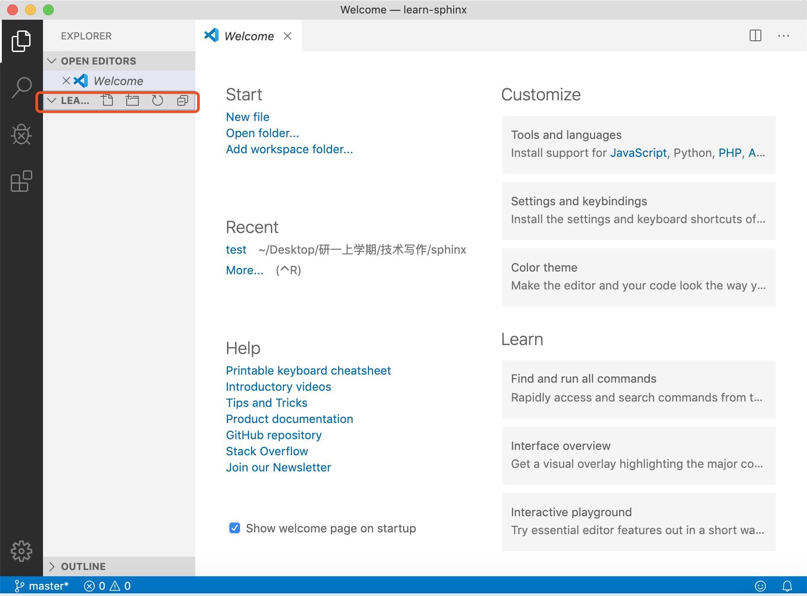
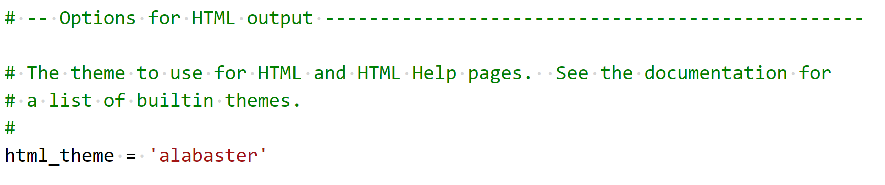

# Sphinx 快速入门

- [Sphinx](http://www.sphinx-doc.org/) 是一种基于 Python 的文档工具，它可以令人轻松的撰写出清晰且优美的文档，由 Georg Brandl 在 BSD 许可证下开发。
- Sphinx 最初是为创作[新版 Python 文档](http://docs.python.org/)而开发的，如今它已成为 Python 项目首选的文档工具，并对其它开发语言也有很好的支持。

- Sphinx 采用 [reStructuredText](https://docutils.sourceforge.io/rst.html) 作为默认标记语言，并使用 [Docutils](http://docutils.sf.net/) 对标记文本进行解析和转换。


---

## Sphinx 开发环境配置

参考 Sphinx 的官方文档，[配置 Sphinx 开发环境](http://www.sphinx-doc.org/en/master/usage/installation.html)主要包括安装 Python 开发环境、使用 pip 工具安装 sphinx 、安装配置文本、代码编辑器等步骤，同时还涉及到使用命令行和修改系统环境变量等操作。这些步骤对于初学者来说略有些复杂繁琐，很容易就迷失在各种琐碎的配置细节中，打击同学们的学习热情。

不过 Python 社区始终有一批能人志士在为简化和优化开发环境配置而作各种努力，Anaconda 就是其中相当出色一个，下面将会介绍如何通过 Anaconda 和 VS Code 在 Windows 和 macOS 两大操作系统上配置 Sphinx 开发环境，同学们可以根据自己使用的操作系统查看相应的部分。

> + **Anaconda** 是一个开源的 Python 发行版，支持 Windows、macOS、Linux，Anaconda 是一个打包的集合，里面预装好了conda、Python 解释器、众多第三方库（比如 Sphinx）、科学计算工具等等，其核心功能是由 conda 提供的包管理与环境管理功能。
>
> + **Visual Studio Code (VS Code)** 是由 Microsoft 公司开发的新一代代码编辑器，支持 Windows、macOS、Linux，将代码编辑器、调试器、终端等工具整合于一体，具有语法高亮、代码补全、括号匹配等功能，支持版本管理和远程开发，并拥有丰富的拓展生态。

---

### Windows 环境配置

> **注意：** 
> - 以下步骤不需要同学们预先安装 Python 解释器（如果之前有安装也可以考虑将其卸载），而是直接使用 Anaconda 内集成的 Python 解释器，如果同学们先前已经安装过单独的 Python 解释器（运行 Sphinx 必须预先安装 Python 3.5 及以上版本），可直接在命令行中使用命令 `pip install sphinx` 安装 Sphinx 及运行 Sphinx 所需要的 [docutils](http://docutils.sourceforge.net/)、[jinja2](http://jinja.pocoo.org/) 等第三方库（前提是 Python 和 Pip 已添加在系统变量的 path 中）。
>
> - 推荐同学们优先使用 Anaconda 来完成 Sphinx 开发环境配置，因为 conda 将几乎所有的工具、第三方库都当做 package 对待，甚至包括 python 和 conda 自身，它可以帮助我们方便地管理自己的 Python 开发环境，不仅能够将不同开发项目所依赖的开发环境完全独立开来，还可轻易地复制整个 Python 环境到其他机器上。

#### Anaconda 安装与配置

Ⅰ. 打开 [Anaconda 官方下载页](https://www.anaconda.com/distribution/)，下载适合的安装包：


> **提示：** 如果官网下载速度较慢，可到清华大学开源软件镜像站下载 [Anaconda 安装包](https://mirrors.tuna.tsinghua.edu.cn/anaconda/archive/)。

Ⅱ. 下载完成后，运行可执行文件进行安装：


> **注意：**
>
> ⑴ Anaconda 需要占用较大的存储空间，可考虑安装在非系统盘。
> 
> ⑵ 请在 “Advanced Options” 中将勾选两个可选选项：
>
> 
>
> - **第一个选项** 会将 Anaconda 的安装目录添加至系统环境变量的 path 中，有利于我们之后在 VS Code 中快速激活 conda 环境，以及直接使用 base 环境中已安装的库和脚本，简化操作流程，若是在安装过程中没有勾选此选项，需要自行添加系统环境变量，即添加Anaconda的安装路径以及到path。
>
> > ① 如上图红字所示，Anaconda 官方不建议勾选此选项，而建议使用 Anaconda Prompt (或 Anaconda Powershell Prompt，以下将两者统称为 Anaconda Prompt) 。这是因为勾选此选项会将 Anaconda 的若干目录添加至 path 目录中的最前面；如果用户之前已经安装了其他 Python 解释器，勾选此选项会导致用户直接调用 Python 时优先调用 Anaconda 内置的 Python 解释器，而不是用户单独安装的 Python 解释器，如下图所示：
> >
> >   
> >
> > ②（可选）假如同学们依然希望系统默认调用先前单独安装的 Python 解释器，只需要在完成Anaconda 安装后，手动将 path 中单独安装的 Python 解释器的路径移动到 Anaconda 目录之前，操作方法如下：
> >
> >   
> >
> > ③ 此时，在命令行调用 Python 时会优先调用单独安装的 Python 解释器，只有在激活 conda 环境后才会调用 conda 里的 Python 解释器。（可以看到两个 Python 解释器的版本和版权说明有所区别）
> >
> >   
> >
>
> - **第二个选项** 可使其他 Python 开发工具（如 VS Code）自动探测到 Anaconda。


Ⅲ. 完成 Anaconda 的安装后，检查 Sphinx 是否已安装。

点击 “开始” 菜单 - “Anaconda3” -  “Anaconda Powershell Prompt”，输入 `conda list` ，回车；

此指令会列出当前 conda 环境 (base) 下所有已安装的包，正常情况下我们可看到若干以 Sphinx 开头的包：




（可选） Anaconda 通常数月才更新一次，但其内部包含的包通常具有更快的更新频次，可使用 Anaconda 的包管理器对包进行单独更新。在 Anaconda Prompt 中输入 `conda update sphinx` 单独对 Sphinx 进行更新，但考虑到我们是第一次使用 Anaconda，更加推荐使用 `conda update --all` 命令对该环境下所有包都进行一次更新：


**注意：**`conda update --all` 命令执行中途需要手动输入一次 `y` 以确认更新操作，整个过程需要一段时间，当命令行最后一行显示 `done` 时，更新完毕，即可关闭命令行窗口。


> **提示：** Anaconda 的默认软件镜像源位于国外，可通过修改 Anaconda 软件镜像源的方式解决在国内可能会遭遇的网络访问不稳定，下载速率慢等问题。（推荐使用清华大学开源软件镜像站的 Anaconda 镜像） 
>
> 具体操作步骤如下：
>
> ​	① 打开 ”开始“菜单 - “Anaconda3” -  “Anaconda Prompt”，输入 `conda config --set show_channel_urls yes` 回车，该命令会在用户文件夹下创建 `.condarc` 文件；
>
> 
>
> ​	② 进入用户文件夹，使用记事本打开`.condarc` 文件，将其中内容替换为如下内容：
>
> ```
> ssl_verify: true
> channels:
>   - defaults
> show_channel_urls: true
> default_channels:
>   - https://mirrors.tuna.tsinghua.edu.cn/anaconda/pkgs/main
>   - https://mirrors.tuna.tsinghua.edu.cn/anaconda/pkgs/free
>   - https://mirrors.tuna.tsinghua.edu.cn/anaconda/pkgs/r
> custom_channels:
>   conda-forge: https://mirrors.tuna.tsinghua.edu.cn/anaconda/cloud
>   msys2: https://mirrors.tuna.tsinghua.edu.cn/anaconda/cloud
>   bioconda: https://mirrors.tuna.tsinghua.edu.cn/anaconda/cloud
>   menpo: https://mirrors.tuna.tsinghua.edu.cn/anaconda/cloud
>   pytorch: https://mirrors.tuna.tsinghua.edu.cn/anaconda/cloud
>   simpleitk: https://mirrors.tuna.tsinghua.edu.cn/anaconda/cloud
> ```
>
> ​	③ 保存并退出`.condarc` 文件。

---

#### Visual Studio Code 安装与配置

Ⅰ. 打开 [Visual Studio Code 官网](https://code.visualstudio.com/)，下载适合的安装包：


Ⅱ. 下载完成后，运行可执行文件进行安装，其安装过程与 Anaconda 安装过程相似：

> **注意：** 请在安装程序的 “选择其他任务” 页中将所有复选框勾选上。
> 

Ⅲ. 完成安装后打开 VS Code，在  ***Extentions*** 中安装 ***Python*** 和 ***reStructuredText*** 拓展。


----

#### VS Code 调用 Sphinx (Anaconda)

完成以上步骤后，已经基本搭建好了一个基于 Anaconda 和 VS Code 的一体化 Sphinx 工作台。在这一环节中，同学们可以检测自己的 Sphinx 开发环境， 为下一节 “第一个 Sphinx 项目” 做好准备。

Ⅰ. 在计算机任意位置新建一个文件夹，命名为 **learn-sphinx**，右击文件夹单击 “通过 Code 打开”。文件夹会显示在左侧边栏，下一小节创建项目的文件将会储存在这个文件夹。


Ⅱ. 打开 VS Code 窗口的集成 Terminal，输入 `sphinx-build --version` 回车。如下所示：


如果一切正常，同学们将会看到已安装 Sphinx 版本号（这里显示的版本是 2.3.0），这说明 Sphinx 开发环境已正确部署至计算机，现在请移步到下一小节学习如何创建[第一个 Sphinx 项目](#2-第一个-sphinx-项目)。


### macOS 环境配置


在mac上配置 Sphinx，可以通过 Anaconda，Homebrew，MacPorts 等方式来完成，这里介绍使用 Anaconda，Pip，和 Homebrew 完成 Sphinx 安装与配置，三种方式选其一即可。

这三种相同点在于都是软件包管理工具，不同点在于 Homebrew 是一个通用的软件包管理工具，终端安装的很多软件包都可以用它来安装；Pip 一般安装一些与 Python 环境相关的软件包，conda 功能与 Pip 类似，目的是为了解决对 Python 以外的依赖环境问题，Pip 在任何环境中安装 Python 包; conda 在 conda 环境中装任何包。

#### Anaconda 安装与配置 （推荐）

> **注意：**
>
> + 以下步骤不需要同学们预先安装 Python 解释器，而是直接使用 Anaconda 内集成的 Python 解释器；
> + 如果同学们先前已经安装过单独的 Python 解释器（运行 Sphinx 必须预先安装 Python 3.5 及以上版本），可查看下一小节 - 使用 Pip 安装 Sphinx；
> + 更加推荐使用 Anaconda 来完成 Sphinx 开发环境配置，因为 conda 将几乎所有的工具、第三方库都当做 Package 对待，甚至包括 Python 和 conda 自身，它可以帮助我们方便地管理自己的 Python 开发环境，不仅能够将不同开发项目所依赖的开发环境完全独立开来，还可轻易地复制整个 Python 环境到其他机器上。

Ⅰ. 打开 [Anaconda 官方下载页](https://www.anaconda.com/distribution/)，下载适合的安装包：


> **提示：** 如果官网下载速度较慢，可到清华大学开源软件镜像站下载 [Anaconda 安装包](https://mirrors.tuna.tsinghua.edu.cn/anaconda/archive/)。

Ⅱ. 下载完成后，运行可执行文件进行安装。

> **注意：** 请在 “Advanced Options” 中将勾选 `Add Anaconda to my PATH environment variable` 和 `Register Anaconda as my defaylt Python 3.7` 两个可选选项：
>
> - **第一个选项** 会将 Anaconda 的安装目录添加至系统环境变量的 path 中，有利于我们之后在 VS Code 中快速激活 conda 环境，以及直接使用 base 环境中已安装的库和脚本，简化操作流程。
>   
>   - Anaconda 官方不建议勾选此选项，而建议使用 Anaconda Prompt (或 Anaconda Powershell Prompt，以下将两者统称为 Anaconda Prompt) 。这是因为勾选此选项会将 Anaconda 的若干目录添加至 path 目录中的最前面；如果用户之前已经安装了其他 Python 解释器，勾选此选项会导致用户直接调用 Python 时优先调用 Anaconda 内置的 Python 解释器，而不是用户单独安装的 Python 解释器，如下图所示：
>   
>     
> - **第二个选项** 可使其他 Python 开发工具（如 VS Code）自动探测到 Anaconda。

Ⅲ. Anaconda 预装了 Sphinx。完成 Anaconda 安装后，可检查一下 Sphinx 的安装情况：

点击启动台-其他-终端，输入`conda list`，回车，此指令会列出当前 conda 环境 (base) 下所有已安装的包，正常情况下可以看到若干以 Sphinx 开头的包：


Ⅳ. （可选） Sphinx 预装在 Anaconda 的默认环境下，同学们可以进一步通过 Anaconda Navigator 中检查 Sphinx 包配置情况，安装更多的包。

> **提示 ：**Anaconda 通常数月才更新一次，但其内部包含的包通常具有更快的更新频次，可使用 Anaconda 的包管理器对包进行单独更新。这里可通过 Anaconda Prompt 输入命令行操作，也可以通过 Anaconda Navigator 进行可视化操作，相对上手更快。

点击启动台 - Anaconda Navigator，左侧菜单选择 Environments，检索框输入 Sphinx ，得到以下列表：

进一步勾选，点击右下角 Apply 进行安装。


#### Pip 安装与配置

Ⅰ. 使用 Pip 配置 Sphinx 也是方便快捷的方式。如果同学们先前安装过单独的 Python 解释器（运行 Sphinx 必须预先安装 Python 3.5 及以上版本），可直接使用第4步中的命令行安装 Sphinx。

   > 提示：如果不确定自己是安装过，可以在终端输入`pip`进行检测。如果出现`-bash: /usr/local/bin/pip: No such file or directory` 提示说明，则尚未安装 Pip，需要进行第2-3步。

Ⅱ. 终端输入`sudo easy_install pip`，输入 mac 密码，进入安装：


Ⅲ. 最终显示`Finished processing dependencies for pip`，Pip 配置完成。可以通过`pip --version` 查看 Pip 版本。


Ⅳ. 终端运行`pip install sphinx`，完成安装。


Ⅴ. 完成安装后，可以检查 Sphinx 配置情况：

终端输入`pip list`，回车，正常情况下可以看到若干以 Sphinx 开头的包：


#### Homebrew 安装与配置

Homebrew 可以视为套件管理器。它是一款 Mac OS 平台下的软件包管理工具，拥有安装、卸载、更新、查看、搜索等很多实用的功能，不需要关注各种依赖和文件路径的情况。配置好 Homebrew 后，安装包、补充缺失的包比较比较便捷。

Ⅰ. Homebrew 依赖于 Xcode Command Line Tools，所以会自动先安装 Xcode Command Line Tools；如果有报错，也可以用命令手动安装：`xcode-select --install`。


Ⅱ. 前往 [homebrew 官网](https://brew.sh)，复制首页代码行到终端执行。


```
/usr/bin/ruby -e "$(curl -fsSL https://raw.githubusercontent.com/Homebrew/install/master/install)"
```


中间需要输入一次 mac 密码：


> 提示：`-bash: brew: command not found` 是一种常见报错，解决办法是在终端输入 `sudo vim .bash_profile`，添加 `export PATH="/usr/local/bin:$PATH"`；最后输入 `source .bash_profile` 使配置生效。

Ⅲ. 出现`Installation successful!`的提示即为 Homebrew 配置完成。


Ⅳ. 完成 Homebrew 配置后，终端输入`brew install sphinx-doc`，安装 Sphinx 。


Ⅴ. 完成安装后，可以检查 Sphinx 配置情况：

终端输入`brew list`，回车，正常情况下可以看到 Sphinx 的包：


---

#### Visual Studio Code 安装与配置

Ⅰ. 打开 [Visual Studio Code 官网](https://code.visualstudio.com/Download)，下载适合的安装包，可以勾选全部复选框完成安装任务。


Ⅱ. 完成安装后打开 VS Code，在  ***Extentions*** 中安装 ***Python*** 和 ***reStructuredText*** 拓展。




#### VS Code 调用 Sphinx (Anaconda)

完成以上步骤后，已经基本搭建好了一个基于 Anaconda 和 VS Code 的一体化 Sphinx 工作台。在这一环节中，同学们可以检测自己的 Sphinx 开发环境， 为下一节 “第一个 Sphinx 项目” 做好准备。

Ⅰ. 在计算机任意位置新建一个文件夹，命名为 “learn-sphinx”，拖至 VS Code 打开。



文件夹会显示在左侧边栏，下一小节创建项目的文件将会储存在这个文件夹。



Ⅱ. 打开 VS Code 窗口的集成 Terminal（可使用 <kbd>Ctrl</kbd> + <kbd>\`</kbd>  快捷键唤出/隐藏），输入 `sphinx-build --version` 回车:

   

如果一切正常，同学们将会看到已安装 Sphinx 版本号（这里显示的版本是 2.3.0），这说明 Sphinx 开发环境已正确部署至计算机，现在请移步到下一小节学习如何创建[第一个 Sphinx 项目](#2-第一个-sphinx-项目)。

---

## 第一个 Sphinx 项目

> **注意：** 以下内容以 Windows 作为操作演示平台，macOS 上的操作基本一致。

前一小节我们利用 Anaconda 和 VS Code 搭建了一体化的 Sphinx 工作台，现在可以启动我们第一个Sphinx 项目了！

### 创建项目

Sphinx 提供了一个快速创建 Sphinx 项目的脚本 `sphinx-quickstart`，这个脚本相当于一个设置向导，它会询问我们一系列问题，并根据我们的回答生成此项目的文档源目录及默认配置文件 conf.py，如图所示：


> **提示：** 所有的项目配置均可在之后通过项目配置文件 *conf.py* 修改。

完成上述步骤后，当前路径下会出现如下文件/文件夹：

```
.
├─ make.bat   # Window下的编译脚本
├─ Makefile   # Linux下的Makefile文件
├─ build      # make编译后产生的导出文件目录
└─ source     # 文档源码目录
    ├─  conf.py     # 项目配置文件
    ├─  index.rst   # 文档源文件入口
    ├─ _static      # 用于存放参与编译的静态文件   
    └─ _templates   # 用于存放项目的主题模板文件
```

现在我们已经成功创建了一个 Sphinx 项目文件，下面的步骤便是为你的项目添加内容与进行装饰了！

但在那之前，让我们看看尝试一下现在能否使用 Sphinx 导出些什么！在终端中输入`make html`，回车；

> **注意：** 
>
> + Powershell（Windows 下 VS Code 的默认终端）需要使用 `.\make html`，`.\` 不可省略 。 
> + `make html` 会对 index.rst  及其关联文件进行编译，并在 `../build/html/`目录下生成 HTML 项目包。


使用浏览器打开 `../learn-sphinx/build/html/`目录下的 index.html 文件，可以看到一个由 Sphinx 生成的简单网页：


尽管我们还未向文档源文件目录中填充具体内容，但这个 “简陋的” 网页已经为我们展示了 Sphinx 生成网页的基本结构：

页面左侧显示了我们的项目名称，并具有导航页和搜索框；页面主体上方有欢迎语，下方是项目创建时间、文档创建说明和页面源文件的链接。

下面我们将学习如何组织我们的文档内容，包括撰写文本内容与定义文档结构。


### 组织内容

Sphinx 使用 reStructuredText 作为默认标记语言，通常我们可以在 source 目录下添加 chapter1.rst、chapter2.rst 等源文件，用于撰写文档的不同章节，并使用 index.rst 对其他 rst 文件进行组织管理。

> **提示：** 
>
> + index.rst 是由 Sphinx 的文档主入口，它可被转换成文档的欢迎页；
> + 建议在 source 目录下新建一个 images 目录用于存放文档中需要插入的图片。

我们将在下一章学习 reStructuredText 的语法，现在先请同学们从本教程的 [GitHub 仓库](https://github.com/dac-tutorial/DAC-Tutorial/tree/master/learn-sphinx) 中获取 chapter1.rst、chapter2.rst、images/basic_screenshot.png 等文件，并将它们存放在我们的 `../learn-sphinx/source` 目录下。

> **提示：** 若需要从 GitHub 仓库中获取单个文件，请在 GitHub 网页端打开该文件后，切换到 Raw 视图，然后右键另存即可。另外请注意 rst 文件会被默认识别为 txt 文件，需要手动在保存时进行修改；也可以在 *conf.py* 中将 txt 扩展名识别为 reStructuredText 文本（在下一小节会提到如何修改 *conf.py* ）。
>
> 

完成后的目录结构如下所示：

```
.
├─ make.bat   # Window下的编译脚本
├─ Makefile   # Linux下的Makefile文件
├─ build      # make编译后产生的导出文件目录
└─ source     # 文档源码目录
    ├─ _static         # 用于存放参与编译的静态文件   
    ├─ _templates      # 用于存放项目的主题模板文件
    │
    ├─ images          # 用于存放文档中需插入的图片
    │    basic_screenshot.png  # 图片文件    
    │
    ├─ chapter1.rst    # 第一章文档源文件
    ├─ chapter2.rst    # 第二章文档源文件
    │
    ├─ conf.py         # 项目配置文件 
    └─ index.rst       # 文档源文件入口
```

完成添加 chapter1.rst, chapter2.rst 等文件后，我们还需要在 index.rst 将这些文件包含进来，并定义我们的文档结构，现在使用 VS Code 对 index.rst 里的 toctree 做如下修改：

```reStructuredText
.. toctree::
   :maxdepth: 2
   :caption: Contents:
   :numbered:

   chapter1
   chapter2
```

其中，toctree 用来于产生目录表，numbered 表示章节编号，maxdepth 表示目录中只显示几层标题，之后空一行，在下面列出各 `.rst` 子文档，可以不加文件后缀，但要注意代码对齐，更多有关`toctree` 的内容可以参见[ Sphinx 官方文档](http://www.sphinx-doc.org/en/master/usage/restructuredtext/directives.html#toctree-directive)。

修改完成后，我们再一次在终端中使用 `make html` 命令，并在浏览器中打开 `../learn-sphinx/build/html/`目录下的 index.html 文件，看看这次我们生成的网页有何不同！


### 修改配置

前一小节我们尝试了使用 Sphinx 默认配置发布了我们的 HTML 网页，现在我们来学习如何修改文档的格式与风格！

Sphinx 项目的配置由 *conf.py* 文件所控制，如果项目是通过 `sphinx-quickstart` 脚本创建的，*conf.py* 将会被自动创建，存放在 *source* 目录下。


如图所示，使用`sphinx-quickstart` 脚本自动创建的 *conf.py* 文件已经包含了该项目的一些基本属性和配置。我们可以通过修改 *conf.py* 的内容以修改 Sphinx 项目配置。

 *conf.py* 中的配置主要包括项目信息、一般配置项以及 HTML 输出选项三大类：

#### 项目信息 (Project information)

由`sphinx-quickstart`脚本创建的 *conf.py* 文件已经包含了项目名称 (project)、版权声明 (copyright)、作者姓名 (author) 以及项目版本 (release) 等项目信息 (Project information)。

目前我们的项目属性（内容是对`sphinx-quickstart`若干问题回答）如下所示，：


此外，可以注意到 release 所在行之上的一条注释，实际上 release 指的是完整的项目版本，除了项目的主要版本 (version) 外，通常还包括 alpha/beta/rc 等标签，例如目前最新的 Python 文档版本号便是 3.9.0a2。

项目主要版本 (version) 也可单独作为一条属性添加在 *conf.py* 中，这样会在之后导出的文档中，在  version 和 release 之间提供分隔。

现在我们可对这些项目属性进行一些改动：


#### 一般配置项 (General configuration)

一般配置项 (General configuration) 的内容十分丰富，我们这里只介绍最常用的几个：

+ **extensions:** 配置 Sphinx 的扩展，内容是 extensions 模块下的字符串列表。

+ **source_suffix:** 定义源文件的文件扩展名，该值可以是字典映射文件扩展名到文件类型，默认为 `source_suffix = {'.rst': 'restructuredtext'}`。

+ **language:** 文档编写的语言代码，Sphinx自动生成的任何文本都将使用该语言。目前 Sphinx 支持的语言及其代码可在 [Sphinx 官方文档](https://www.sphinx-doc.org/en/master/usage/configuration.html#confval-language)上查询到，我们平时比较常用的有英文和简体中文两种，其语言代码分别是`en` 与`zh_CN`。

---

##### 练习1：为 Sphinx 项目添加 Markdown 支持

> **提示：**
>
> + Markdown 是一种与 reStructuredText 类似的标记语言，其语法甚至比 reStructuredText 更加简单一些。Markdown 是目前最受欢迎的标记语言，GitHub、Stack Overflow、reddit 以及知乎、简书等网站均支持这种格式。本教程的博客提供了一个 [Markdown 简明教程](https://dac-tutorial.github.io/Markdown-%E7%AE%80%E6%98%8E%E6%95%99%E7%A8%8B/)，欢迎同学们学习！
>
> + Sphinx 默认仅支持 reStructuredText 标记语言，但我们可以通过安装 recommonmark 源解析器扩展使其支持添加 Markdown 标记语言。安装方法可参阅 [Sphinx 官网文档](http://www.sphinx-doc.org/en/master/usage/markdown.html)。


请尝试为我们的 ***learn-sphinx*** 项目添加 Markdown 支持，并在原文档目录下添加一个由 ***index.rst*** 管理的 ***chapter3.md*** 文件（从本教程的 [GitHub 仓库](https://github.com/DAC-Tutorial/DAC-Tutorial/tree/master/learn-sphinx/source) 获取该文件）。 

> **步骤：**
>
> ⑴ 首先，使用 conda 工具安装 recommonmark 扩展，在 Anaconda Prompt 中执行命令:
>
> ```
> conda install recommonmark
> ```
>
> 
>
> > **提示：**非 Anaconda 环境下可使用 `pip install recommonmark` 安装 recommonmark 扩展。
>
> ⑵ 然后，对 ***learn-sphinx*** 项目 ***conf.py*** 做如下修改：
>
> ```python
> extensions = ['recommonmark']
> 
> source_suffix = {
>  '.rst': 'restructuredtext',
>  '.txt': 'restructuredtext',
>  '.md': 'markdown',
> }
> ```
>
>  
>
> 这里我们通过添加 `recommonmark`扩展为 Sphinx 开启了 Markdown 支持，并将 `.rst` 和 `.txt` 映射到 `'restructuredtext'` 文件类型，将 `.md`映射到 Markdown 文件类型。
>
> ⑶ 接着，请同学们从本教程的 [GitHub 仓库](https://github.com/DAC-Tutorial/DAC-Tutorial/tree/master/learn-sphinx/source) 获取 ***chapter3.md*** 文件，并将其存放在我们的 ../learn-sphinx/source 目录下。
> 
> ⑷ 最后，修改 ***index.rst*** 文件，将 ***chapter3.md*** 添加到文件目录下：
>
> 
>
> **特别注意：** 在 *index.rst* 种引用 reStructuredText 文件时可省略`.rst` 扩展名，但引用 Markdown 文件时不可省略 `.md` 扩展名。为确保引用格式正确，建议在一个文档内引用不同格式文本时不省略`.rst` 扩展名。


#### HTML 输出选项 (Options for HTML output)

这些选项会影响 Sphinx 中 HTML 文档的输出，以及其他使用 Sphinx 的 HTMLWriter 类的文档构建器。

这里只介绍一个最常用的 **html_theme** ，该配置项会影响 Sphinx 编译输出 HTML 的主题风格，用户通过修改 **html_theme** 的值以修改 HTML 主题。



Sphinx 默认的 HTML 主题为 alabaster，alabaster 是 Sphinx 的内置主题之一，Sphinx 内置主题还包括 **basic**、**classic**、**sphinxdoc**、**scrolls**、**agogo**、**nature**、**pyramid**、**haiku**、**traditional**、**epub**、**bizstyle** 等 11 种。

此外，还有不少第三方主题（例如 **sphinx_rtd_theme**）可通过额外安装后使用，更多有关主题设置与定制的内容请参考 [Sphinx 官方文档](http://www.sphinx-doc.org/en/master/usage/theming.html)，之后的 “**Sphinx 主题定制**” 学习专题也会对此有进一步介绍。

---

##### 练习2：为 Sphinx-HTML 网页换一种风格

请在完成 **练习1：为 Sphinx 项目添加 Markdown 支持** 的基础上，修改 Sphinx 项目的 HTML 的主题为任一 Sphinx 内置主题，并将其发布。

> **参考样例：**
>
> 
>
> 样例源文件存放在本教程的 [GitHub 仓库](https://github.com/dac-tutorial/sphinx-html-demo) 中，其 HTML 主题为 Sphinx 内置的 **scrolls**。
>
> 

---

本小节只介绍了一些比较常用的 Sphinx 项目配置属性，更多内容请参考 [Sphinx 官方文档](https://www.sphinx-doc.org/en/master/usage/configuration.html)。


### 发布文档

在前面三个小节中，我们已经多次使用 `make html` 将我们的 Sphinx 项目发布成本地的 HTML 网页。

实际上，我们也可以使用 Sphinx 的 [`sphinx-build`](http://www.sphinx-doc.org/en/master/man/sphinx-build.html) 命令达到相同的效果，删除先前用 `make html` 生成的`../build/html/`目录内的全部文件，然后在终端中输入下面这行命令：

```powershell
sphinx-build -b html <sourcedir> <builddir>

# -b 是创建工具的选项，html 指创建的是 html 文件
# <sourcedir> 指项目的源目录，默认应填 source 
# <builddir> 指导出文档的目录，默认应填 build
```


命令执行完成后，网页文件会存放在指定的导出目录下。实际上，`make html` 即是利用 Makefile 和 make.bat 批处理文件简化了 `sphinx-build` 的操作，两者在本质上基本相同。

教程第三部分的 “**Sphinx 文档发布**” 学习专题将进一步介绍如何使用 Sphinx 构建 PDF、LaTeX 等格式的文档，此专题还介绍了如何将 Sphinx 发布的网页托管至云端，以实现 HTML 文档的公网访问。

---

至此，同学们应已初步了解了文档代码化的基本思想，并着手创建、完善了自己的第一个 Sphinx 项目。下面我们还将学习 reStructuredText 和 Markdown 的基础语法，更多的进阶内容也将以学习专题的形式呈现，欢迎同学们继续学习！