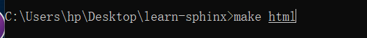
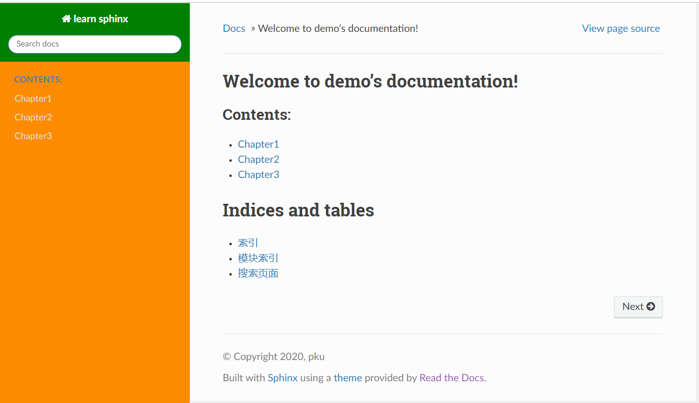
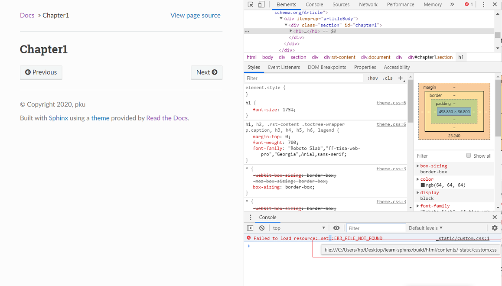

Sphinx 主题定制
====================

使用既定主题
------------

正如入门指南中所述，下载 Sphinx 后，其安装包中即含有名为 *themes*
的文件夹， 包括
basic、alabaster、classic、sphinxdoc、scrolls、agogo、nature、pyramid、haiku、traditional、epub、bizstyle
等 12 种内置主题，此外还有不少第三方主题（例如
sphinx\_rtd\_theme）可通过额外安装后使用。

这里我们主要介绍如何安装并使用
`sphinx-rtd-theme <https://sphinx-rtd-theme.readthedocs.io/en/latest/>`__。

安装主题模板
~~~~~~~~~~~~~~~

直接进入命令行，输入 ``pip install sphinx-rtd-theme``\ ，如下图所示：

.. figure:: images/install-rtd.png
   :alt: intall-rtd

   
出现如下代码段即可表示安装成功：

.. figure:: images/rtd-install-done.png
   :alt: intall-rtd

   
完成以上步骤后，同学们可以在 **python** 的安装文件下找到
**sphinx-rtd-theme**\ 文件夹，笔者的文件夹路径则如下所示：

::

     D:\Python\Python38-32\Lib\site-packages\sphinx_rtd_theme

在 \sphinx\_rtd \_theme\ - *theme.conf* 文件中， 该主题的默认配置如下：

::

     [theme]
     inherit = basic
     stylesheet = css/theme.css
     pygments_style = default

     [options]
     canonical_url =
     analytics_id =
     collapse_navigation = True
     sticky_navigation = True
     navigation_depth = 4
     includehidden = True
     titles_only =
     logo_only =
     display_version = True
     prev_next_buttons_location = bottom
     style_external_links = False
     style_nav_header_background =

基本选项含义：

-  ``inherit`` 给出了 “基本主题” 的名称。

-  ``stylesheet`` 给出了将在 **HTML** 标头中引用的css文件的名称。

-  ``pygments_style`` 给出了用于突出显示的Pygements 样式的名称。

-  ``analytics_id`` 字符串。配置 Google Analytics ID
   可以追踪网站访问情况。

-  ``display_version`` 布尔值。配置是否显示版本号。

-  ``collapse_navigation`` 布尔值。启用后，不在导航栏中显示 +。

-  ``navigation_depth`` 整数。最大深度为4层，设置为 -1 表示不限制深度。

修改配置文件：
~~~~~~~~~~~~~~~~~

在 *conf.py* 中进行如下设置：

::

    html_theme = 'sphinx_rtd_theme'

生成网页
~~~~~~~~~~~

命令行中再次输入 ``make html``

   
即可生成相应主题的网页：

.. figure:: images/sphinx-rtd-theme.png
   :alt: rtd主题展示

  
用户自定义主题
--------------

Sphinx里面的模板是已经定义好了的，如果想要自定义主题，如修改主题的颜色、为主题增添内容等，那我们需要掌握一定的
**jinja2**\ 、\ **HTML** 与 **CSS知识**\ 。

基础知识
~~~~~~~~

**HTML**
^^^^^^^^^^

超文本标记语言（英语：HyperText Markup
Language，简称：HTML）是一种用于创建网页的标准标记语言。

同学们可以使用 **HTML** 来建立自己的 WEB 站点，\ **HTML**
运行在浏览器上，由浏览器来解析。

代码示例
''''''''

::

     <!DOCTYPE html>
     <html>
     <head>
     <meta charset="utf-8">
     <title>菜鸟教程(runoob.com)</title>
     </head>
     <body>
     <h1>我的第一个标题</h1>
     
我的第一个段落。

     </body>
     </html>

代码解释
''''''''

-  ``<!DOCTYPE html>`` 声明为HTML5文档

-  ``<html>`` 是 **HTML** 页面的根元素

-  ``<head>`` 元素包含了文档的元数据，如
   ``<meta charset="utf-8">``\ 表示网页编码格式为 **utf-8**

-  ``<title>`` 描述了文档的标题

-  ``<body>`` 包含了可见的页面内容

-  ``<h1>`` 定义一级标题

-  ``
`` 定义一个段落

推荐学习
''''''''

网上有很多免费的 **HTML** 教程，推荐如下：

-  `HTML菜鸟教程 <https://www.runoob.com/html/html-tutorial.html>`__

-  `SiKi学院JavaEE
   WEB前端第一季 <https://www.bilibili.com/video/av35875257?from=search&seid=1420480764639162062>`__

**CSS**
^^^^^^^^^^^^^

**CSS** 用于控制网页的样式和布局。

示例
''''

::

     body
     {
     background-color:red;
     }
     h1
     {
     color:orange;
     text-align:center;
     }
     p
     {
     font-family:"Times New Roman";
     font-size:20px;
     }

代码解释
''''''''

::

       body
          {
          background-color:#d0e4fe;
          } 

这段代码表示网页主题的背景色为红色。

::

       h1
          {
          color:orange;
          text-align:center;
          }

这段代码表示标题1字体颜色为橘色，居中显示。

::

      p
          {
          font-family:"Times New Roman";
          font-size:20px;
          }

这段代码表示段落文字的字体为 **Times New Roman**\ ，字体大小为
**20px**\ 。

推荐学习
''''''''

网上有很多免费的 **CSS** 教程，推荐如下：

-  `CSS菜鸟教程 <https://www.runoob.com/css/css-tutorial.html>`__

**jinja2**
^^^^^^^^^^^^

如想对主题增添内容，那我们需要使用 **jinja2** 语言， **jinja2** 是
**Flask** 作者开发的一个模板系统，起初是仿 **django**
模板的一个模板引擎，为 **Flask**
提供模板支持，由于其灵活，快速和安全等优点被广泛使用。

**Jinja** 模版是一个文本文件，通过它可以生成任何文本格式的文件，例如
**.html**\ 、\ **.xml**\ 、\ **.csv** 等等。一个 **Jinja**
模版并不需要有一个特定的扩展名，完全可以自定义或是不定义.

**Jinja**
模版包含了变量、表达式和标签，当模版被渲染时，变量和表达式会被替换为特定的值，标签用来控制模版的逻辑。

代码示例
''''''''

::

     <!DOCTYPE html>
     <html lang="en">
     <head>
     <title>My Webpage</title>
     </head>
     <body>
     <ul id="navigation">
     
          <li><a href="{{ item.href }}">{{ item.caption }}</a></li>
     
     </ul>

     <h1>My Webpage</h1>
     {{ a_variable }}

     {# a comment #}
     </body>
     </html>

代码解释
''''''''

-  ```` 表示循环结构

-  ``{{...}}`` 里内含变量，需要对其进行赋值

-  ``{#...#}`` 用于注释，方便理解代码，并不会输出到结果文件中

-  ```` 表示循环体的结束

-  ``{{ item.href }}`` 表示访问 **item** 这个变量的 **href** 属性

推荐学习
''''''''

网上有很多免费的 **HTML** 教程，推荐如下：

-  `jinja2教程1 <https://www.w3cschool.cn/yshfid/>`__
-  `jinja2教程2 <https://read.helloflask.com/c3-template>`__

自定义主题实操
~~~~~~~~~~~~~~~

要自定义文档的输出，可以通过将与原始文件名同名的文件添加到模板目录中来覆盖所有的模板。 Sphinx 将首先在
*config.py* 中的 template\_path
和\ *html\_static\_path*\  中查找模板，如果找不到它正在寻找的模板，将回退到所选主题的模板。

Sphinx安装目录下的 *themes*-*basic* 中包含 *basic* 主题，该主题中的
*layout.html*
为基本模板提供了几个块，这些块使用\ **jinja2**\ 首先填充原始数据，并由所有内置的Sphinx主题使用。而
**templates\_path** 中具有相同名称的模板会覆盖所选主题提供的模板。

该教程简单演示如何使用两种方法更改 **Sphinx\_rtd\_theme**
主题左侧导航栏的颜色。

安装jinja2
^^^^^^^^^^^^^

Anaconda 环境中已经集成了 jinja2，因此无需再次安装。

查看需要修改的网页模块
^^^^^^^^^^^^^^^^^^^^^^^^^^^^^^^

因为我们想要修改导航栏的颜色，所以需要知道生成的网页中左侧导航栏所对应的网页代码。

我们首先进入生成的网页，点击鼠标右键，进入\ **检查**\ ，找到如下代码块：

.. figure:: images/nav-class.png
   :alt: nav-class

   
.. figure:: images/nav-class2.png
   :alt: nav-class2

   
由以上代码块可知，导航栏所对应的模块属性为 ``wy-side-nav-search``\ 、
``wy-nav-top``\ 、\ ``.wy-nav-side``\ 。因此，我们只需要对这几个属性进行修改即可。

方法一
^^^^^^^^^^^

创建 同名模板 *layout.html*
''''''''''''''''''''''''''''''''

在文件夹里找到 *source*-*templates* 文件夹，然后在 *templates*
文件夹下创建 *layout.html*。

使用 **jinja2** 在 *layout.html* 中编写如下代码：

::

     
      {{ super() }}

     
     % endblock %}

对以上代码块解释如下：

-  ``{#...#}`` 相当于注释，是为了方便理解代码。

-  ````
   在带有感叹号的被覆盖模板的名称前面加上前缀，Sphinx将从底层HTML主题加载布局模板。

-  ```` 表示对 *footer* 代码块进行改写。

-  ``{{ super() }}`` 表示继承原模板，即呈现块的原始内容。

-  ```` 表示代码块结束。

此段代码的作用是在把网页头部导航栏背景色设置为绿色，左侧导航栏背景色设置为深橘色。

修改配置文件
''''''''''''''''''

我们需要同步修改 *config.py* 中的配置：

::

     templates_path = ['_templates']

生成网页
'''''''''''''''

点击保存后，重新在命令行中键入 ``make html``\ ，即可生成如下网页：

   
方法二
^^^^^^^^^^^^

该方法与方法一同理，只是把 *css* 文件单拎了出来, 即在 *layout.html*
中链接了外部的 *css* 文件，并将 *css* 文件置于\ *static* 文件夹下。

创建同名模板 *layout.html*
''''''''''''''''''''''''''''''''

编写代码如下：

::

     
      {{ super() }}

     <link rel="stylesheet" type="text/css"
     href="_static/custom.css">

     % endblock %}

对以上代码块解释如下：

-  ``link rel="stylesheet"...custom.css`` 表示外链样式表。

创建 *custom.css*
''''''''''''''''''''''

在文件夹里找到 *source*-*static* 文件夹，然后在 *static* 文件夹下创建
*custom.css*.

使用 **css** 语言 在 *custom.css* 中编写如下代码：

::

     .wy-side-nav-search, .wy-nav-top 
     {
          background: green;
     }
     .wy-nav-side 
     {
          background: darkorange;
     }

修改配置文件
'''''''''''''''''

与此同时，在 *config.py* 中进行如下设置：

::

     html_static_path = ["_static"]

     templates_path = ['_templates']

生成网页
'''''''''''''

点击保存后，重新在命令行中键入 ``make html``\ ，即可生成如下网页：

单个网页主题修改
^^^^^^^^^^^^^^^^^^^

经过以上操作步骤后，主页主题已修改完毕，但是当我们打开单个页面（如Chapter1）后，主题样式却并没有发生更改。如下图所示：

.. figure:: images/single-html.png
   :alt: 单个主题页面

原因为何呢？我们可以通过检查网页代码来找到答案。

在上图所示的页面点击鼠标右键，然后点击 **检查** ，在控制台可以看到如下提示：

.. figure:: images/error-warning.png
   :alt: 控制台错误

报错信息提示：找不到 **css** 文件的位置。将鼠标悬浮在报错信息上，出现如下路径地址：

发现原来是 **css** 文件的地址出错了。为解决该问题，我们按照提示，
将 *static* 文件夹复制到 *build*-*html*-*contents* 文件夹下，保存后再次输入 ``make html``\ ，即可看到成功为子页面生成了主题。

.. figure:: images/single-html-theme.png
   :alt: 路径地址

如果同学们想要改变网页的布局、字体信息等，都可以通过修改 *custom.css* 文件来实现。